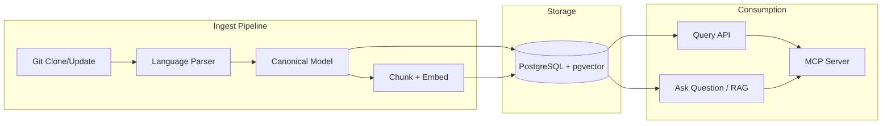
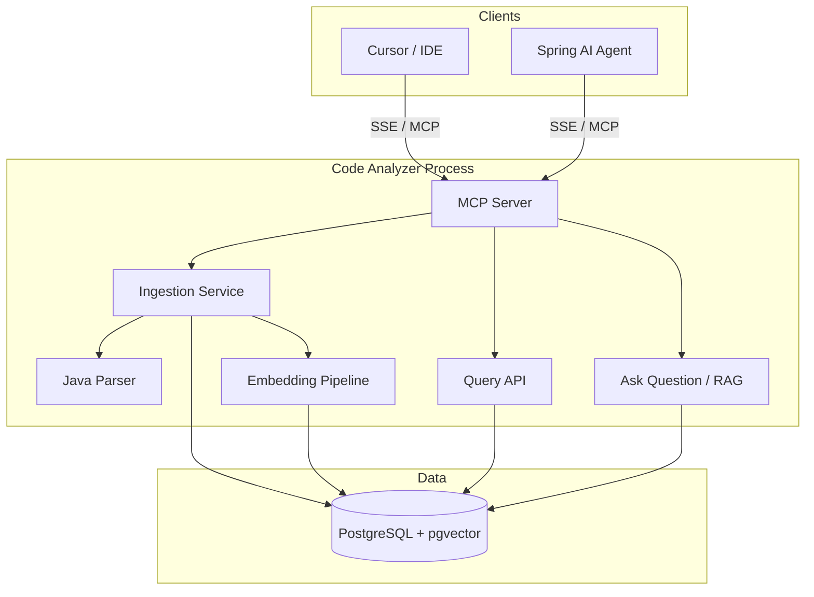

# Code Analyzer Agent — Architecture

This document describes the logical structure, data flow, deployment options, and technology mapping for the Code Analyzer. For requirements and high-level decisions see [01-requirements.md](01-requirements.md) and [02-high-level-design.md](02-high-level-design.md).

---

## 1. Logical View

The system is organized into three main areas: **ingest**, **storage**, and **consumption**. Storage includes both a relational database and a **vector database** with embeddings and linkages from the start.

- **Ingest pipeline:** Repository provider → list files → per-file parser → canonical semantic model. Then **chunking** (define units to embed, e.g. symbol + docstring), **embedding** (via embedding model), and **persist to PostgreSQL** (relational tables and pgvector tables) with metadata and linkages (entity ids, optional related-chunk ids). Orchestrated by an ingestion service.
- **Storage:** **PostgreSQL with pgvector** — one database for both **relational** tables (symbols, artifacts, references, containment, spans, file contents) and **vector** data (embeddings + metadata + linkages). Both are snapshot-scoped and replaced on full re-run.
- **Consumption:** Query API performs snapshot-scoped reads against **PostgreSQL** (relational tables); **Ask Question / RAG** uses **pgvector** (same PostgreSQL) for semantic search and linkages (and optionally relational tables for references/containment/file content) to answer natural-language questions. MCP server exposes both structured tools and **ask_question**.

---

## 2. Data Flow

### 2.1 Ingest Path

1. Client invokes MCP tool `analyze_repository(repo_url, ref)` (or equivalent trigger).
2. **Repo provider:** Clone repo (or open workspace), resolve ref to commit SHA.
3. **Ingestion service:** Enumerate files to analyze (e.g. by extension or config).
4. For each file: **Parser registry** selects parser by extension/language → parser produces canonical model fragment (symbols, refs, containment, spans).
5. **Ingestion service:** Optionally resolve cross-file references; then bulk-insert/upsert into **PostgreSQL** (relational tables) in a transaction, replacing existing data for `(repo_url, commit_sha)`. Store file contents as needed.
6. **Embedding pipeline:** For the same snapshot, **chunk** the canonical model (e.g. per symbol: name + signature + docstring), compute **embeddings** (via embedding model), and write to **pgvector** (same PostgreSQL) with metadata (snapshot_id, artifact_id, symbol_id, path, span, kind) and **linkages** (to relational entities; optionally to related chunk ids for context expansion). Replace existing vector data for this snapshot.
7. Return snapshot id (e.g. commit SHA) to caller.

### 2.2 Structured Query Path

1. Client invokes an MCP tool (e.g. `search_symbols`, `find_references`, `get_containment`, `get_file_content`) with a snapshot id (and other parameters).
2. **MCP server** routes the call to the **Query API**.
3. **Query API** executes snapshot-scoped reads against **PostgreSQL** (relational tables), returns structured results.
4. **MCP server** returns the result to the client.

### 2.3 Ask Question Path (Vector DB + Linkages + optional RAG)

1. Client invokes **`ask_question`** (or `query_codebase`) with a **snapshot_id** or a **project_id** (or list of snapshot_ids) and a natural-language question.
2. **MCP server** routes to the **Ask Question / RAG** component. If **project_id** is provided, resolve it to the set of snapshot_ids linked to that project (via relational store: project → project_snapshots).
3. **Semantic search:** The question is embedded (same model as ingestion). Vector DB is queried for similar embeddings filtered by **snapshot_id IN {single snapshot or project’s snapshot list}**, returning top-k chunks with metadata and linkages. This allows **linking related codebases**: chunks from all linked snapshots (e.g. frontend repo + backend repo) are considered together when answering.
4. **Context expansion (optional):** Using linkages, fetch related chunks (e.g. same file, referenced symbol) or relational data (references, containment, file content). If **cross-codebase linkages** are stored (e.g. chunk in repo A references symbol in repo B), optionally include those related chunks from other snapshots in the project in the RAG context.
5. **Answer:** Either (a) return ranked chunks with metadata (including which snapshot/repo each chunk came from) for the client to interpret, or (b) **RAG:** build a prompt with retrieved chunks (and optionally file content) from one or more codebases, call an LLM, return generated answer.
6. **MCP server** returns the answer or chunks to the client.

All query operations are read-only. Single-snapshot queries are scoped to that snapshot; **project-scoped** queries are scoped to the union of snapshots linked to the project.

---

## 3. Deployment View

- **Default:** Single process (e.g. JVM) running Spring Boot. **PostgreSQL with pgvector** as the single database (relational + vector). MCP server exposed over HTTP SSE. Embedding model and optional LLM for RAG can be local or remote (API). Suitable for desktop or single-node deployment.
- **Alternative:** Same application with external PostgreSQL (with pgvector) for production or multi-instance; MCP still in-process.
- **Clients:** Cursor, other MCP clients, or a separate Spring AI agent that calls this server as an MCP tool source (including **ask_question**).

---

## 4. Technology Mapping

| Concern            | Technology |
|--------------------|------------|
| Runtime / language | Java 25    |
| Application host   | Spring Boot 4.x |
| MCP server         | MCP Java SDK; Spring transport (WebMVC or WebFlux SSE) |
| MCP / Spring integration | Spring AI (MCP server boot starter or equivalent) |
| Java parsing       | JavaParser (or equivalent) → canonical model adapter |
| **Database** | **PostgreSQL with pgvector** — single database for relational schema and vector store. Schema migrations (e.g. Flyway/Liquibase). See [07-vector-database-comparison.md](07-vector-database-comparison.md). |
| **Embeddings**      | Spring AI embedding model (e.g. OpenAI, Azure OpenAI, or local model); same model for ingest and query |
| **Ask Question / RAG** | Spring AI (vector store search, optional chat model for answer generation); uses linkages for context expansion — see [05-java25-spring-ai.md](05-java25-spring-ai.md) |

---

## 5. Key Interfaces (Conceptual)

- **CodeRepository:** Clone or open repo; resolve ref to commit; list files (paths and optionally content).
- **SemanticParser:** Parse one file (path + content) → list of symbols, spans, references, containment for the canonical model.
- **ChunkingStrategy:** From canonical model (per snapshot), produce units to embed (e.g. symbol + docstring + signature); optionally produce linkage keys (related chunk ids, symbol ids).
- **EmbeddingPipeline:** Chunk → compute embedding (Spring AI embedding model) → store in **pgvector** (PostgreSQL) with metadata and linkages; delete/replace for snapshot on re-run.
- **IngestionService:** Given repo + ref, run repo provider, run parser per file, persist to **PostgreSQL** (relational), then run embedding pipeline for the same snapshot (pgvector).
- **QueryService:** Snapshot-scoped read methods against **PostgreSQL** (relational tables): get snapshot, search symbols, get symbol, find references, get containment, get file content.
- **ProjectService (optional):** Create/list/get projects; link snapshot_ids to a project (stored in **PostgreSQL**: e.g. project table, project_snapshots junction). Used when **ask_question** is called with project_id.
- **AskQuestionService:** Given **snapshot_id or project_id** (or snapshot_ids) and natural-language question: resolve project_id to snapshot list if needed; embed question; query **pgvector** (PostgreSQL) with filter by snapshot_id IN snapshot list so that **related codebases are linked**; optionally expand context via linkages (including cross-codebase if available) and relational tables; return ranked chunks or run RAG and return answer. Chunk metadata includes snapshot_id/repo so that answers can attribute results to the right codebase.
- **MCP tool handlers:** Map each MCP tool to Query, Ingest, ProjectService, or AskQuestionService; **ask_question** invokes AskQuestionService; project management tools invoke ProjectService.

This architecture keeps the analyzer language-agnostic, supports both structured queries and natural-language Q&A via a vector database with correct embeddings and linkages, and supports **linking related codebases** so that SDLC agents can ask questions across multiple repos during agentic development. Consumption is read-only and scoped by snapshot or by project (union of linked snapshots).

---

## 6. Scalability (Very Large Codebases, e.g. Million Lines)

The design **can scale** to very large codebases (on the order of **a million lines of code**, i.e. tens of thousands of files and hundreds of thousands of symbols/chunks) provided the following are addressed in implementation and deployment.

### 6.1 Scale Dimensions

| Dimension | Approximate scale (1M LOC) | Concern |
|-----------|----------------------------|---------|
| Files | ~10k–50k | Parse time, memory if all loaded at once |
| Symbols (relational) | ~100k–500k+ | Insert/query time, index size |
| References | ~500k–2M+ | Table size, join cost |
| Vector chunks | ~100k–500k+ | Embedding API limits, vector DB size, search latency |
| File contents | ~1M lines stored | Storage size, retrieval for RAG |

### 6.2 Ingest Scalability

- **Parsing:** Run parsing in **parallel** (e.g. by file or by directory) with a bounded worker pool (e.g. virtual threads or executor with fixed size) so that CPU and memory stay bounded. Stream or batch insert into the relational DB instead of holding the full model in memory.
- **Relational persistence:** Use **bulk insert** (batch inserts, COPY, or equivalent) per snapshot. **Partition or index** by `snapshot_id` (and optionally `repo_url`) so that replace-by-snapshot is a partition drop + bulk load, or batched delete + insert. Avoid single-row inserts in a single transaction for millions of rows.
- **Chunking and embedding:** Produce chunks in a **streaming or batched** fashion from the canonical model (or from DB). Call the embedding API in **batches** (e.g. 100–500 texts per request where the API allows) with **backpressure and rate limiting** to respect provider limits (e.g. OpenAI rate limits). Persist to the vector DB in batches. For 100k+ chunks, consider **async or background** ingestion so that `analyze_repository` can return snapshot_id once relational data is committed and embedding runs as a follow-up (or the client polls for completion).
- **Memory:** Avoid loading the entire repo or all chunks in memory. Process file-by-file or batch-by-batch; stream file content to the parser and to the embedding pipeline.

### 6.3 Relational Database Scalability

- **Indexes:** Index on `(snapshot_id, …)` for all snapshot-scoped queries; index on symbol name, path, reference endpoints for search and graph queries. For very large tables, consider **partitioning** (e.g. by snapshot_id or by repo).
- **Replacement strategy:** For full re-run, prefer **partition replacement** (e.g. drop partition for snapshot, attach new partition) or **batched delete + batched insert** rather than one huge transaction.
- **Connection and pool:** Use connection pooling and tune for bulk workload during ingest and for read-heavy workload during query.

### 6.4 Vector Database Scalability

- **ANN index:** Use an **approximate nearest-neighbor (ANN)** index (e.g. HNSW, IVFFlat in pgvector, or the default in dedicated stores like Pinecone, Weaviate, Qdrant) so that similarity search over hundreds of thousands of vectors stays sub-second. Exact search does not scale to millions of vectors.
- **Filtering by snapshot_id:** Ensure the vector store supports **metadata filtering** (e.g. by `snapshot_id`) so that search is restricted to the relevant snapshot and index size per query is effectively the snapshot’s vectors, not the entire DB.
- **Store:** The chosen store is **PostgreSQL with pgvector**. For millions of vectors, use an appropriate ANN index (e.g. HNSW) and PostgreSQL tuning; see [07-vector-database-comparison.md](07-vector-database-comparison.md).
- **Replacement:** When replacing vectors for a snapshot, use batch delete (by snapshot_id) and batch insert; avoid deleting/inserting one-by-one.

### 6.5 Query and RAG Scalability

- **Structured queries:** **Paginate** large result sets (e.g. search_symbols, find_references) with a limit and offset or cursor so that responses and latency stay bounded.
- **ask_question:** Restrict to **top-k** (e.g. 10–50) chunks; do not retrieve the full result set. Context expansion via linkages should also be bounded (e.g. at most N related chunks or one file content per hit) so that RAG prompt size and latency remain acceptable.
- **RAG prompt size:** Cap the total context (retrieved chunks + file snippets) sent to the LLM to avoid token limits and slow responses.
- **Project-scoped ask_question (linked codebases):** When the scope is a **project** (multiple snapshot_ids), the vector search filter is `snapshot_id IN (project's snapshot list)`. The ANN index and top-k limit still apply, so latency remains bounded; the union of linked codebases may increase total vectors in the filtered set, so ensure the vector store supports efficient multi-snapshot filter (e.g. metadata index on snapshot_id).

### 6.6 Optional: Incremental and Partial Ingest

- For very large repos, **incremental ingestion** (only changed files between commits) reduces re-work. This requires: (1) diff or list of changed files between two commits, (2) re-parse only those files, (3) update relational rows for affected artifacts/symbols and **update or re-embed only affected chunks** in the vector store. Out of scope for v1 but the schema (snapshot_id, artifact_id, symbol_id) supports it later.
- **Partial ingest** (e.g. only certain directories or file types) can reduce scale for a given run; document this as an option for users who need to analyze a subset of a huge repo.

### 6.7 Summary

With **parallel/batched parsing**, **batched embedding with rate limiting**, **indexed and optionally partitioned relational store**, **ANN-enabled vector store with snapshot filtering**, and **paginated/bounded queries**, the architecture can scale to **a million lines of code**. Ingest may take minutes to tens of minutes depending on embedding API and hardware; query latency (including **ask_question**) can remain in the sub-second to few-second range with the right store and indexes.
