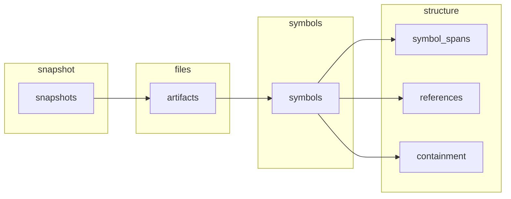
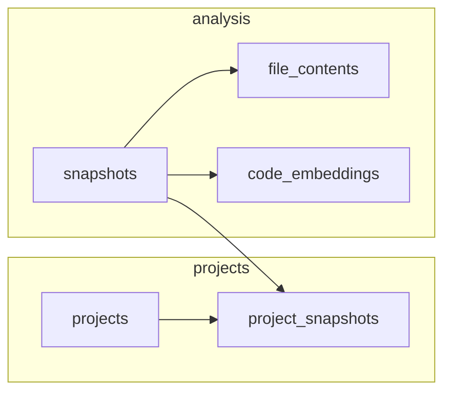

# Database Schema and Relationships

This document describes the PostgreSQL schema used by the code-analyzer-agent: tables, relationships, and how to inspect stored data.

---

## Entity-Relationship Overview

```mermaid
erDiagram
    snapshots ||--o{ artifacts : "has"
    snapshots ||--o{ file_contents : "has"
    snapshots }o--o{ project_snapshots : "linked in"
    projects }o--o{ project_snapshots : "contains"

    artifacts ||--o{ symbols : "contains"
    symbols ||--o| symbol_spans : "has location"
    symbols ||--o{ references_from : "references"
    symbols ||--o{ references_to : "referenced by"
    symbols ||--o{ containment_parent : "contains"
    symbols ||--o{ containment_child : "contained in"

    snapshots ||--o{ code_embeddings : "has"
    artifacts ||--o{ code_embeddings : "optional link"
    symbols ||--o{ code_embeddings : "optional link"

    snapshots {
        bigserial id PK
        varchar repo_url
        varchar commit_sha
        timestamptz created_at
    }

    artifacts {
        bigserial id PK
        bigint snapshot_id FK
        varchar file_path
    }

    symbols {
        bigserial id PK
        bigint artifact_id FK
        varchar name
        varchar kind
        varchar visibility
    }

    symbol_spans {
        bigint symbol_id PK_FK
        varchar file_path
        int start_line
        int start_column
        int end_line
        int end_column
    }

    references {
        bigserial id PK
        bigint from_symbol_id FK
        bigint to_symbol_id FK
        varchar ref_type
    }

    containment {
        bigserial id PK
        bigint parent_symbol_id FK
        bigint child_symbol_id FK
    }

    file_contents {
        bigint snapshot_id PK_FK
        varchar file_path PK
        text content
    }

    projects {
        bigserial id PK
        varchar name
        text description
    }

    project_snapshots {
        bigint project_id PK_FK
        bigint snapshot_id PK_FK
    }

    code_embeddings {
        uuid id PK
        bigint snapshot_id
        text content
        vector embedding
        bigint artifact_id
        bigint symbol_id
        varchar file_path
        text span
        varchar kind
    }
```

---

## Table Descriptions and Relationships

### Core analysis chain

| Table | Purpose | Key relationships |
|-------|---------|-------------------|
| **snapshots** | One row per analyzed (repo_url, commit_sha). Each run of `analyze_repository` creates or reuses a snapshot. | Parent of `artifacts`, `file_contents`, `code_embeddings`; can be linked to `projects` via `project_snapshots`. |
| **artifacts** | One row per file in a snapshot (e.g. a Java file). | Belongs to `snapshots`; parent of `symbols`. |
| **symbols** | Named code entities in a file: class, method, field, etc. | Belongs to `artifacts`; has optional `symbol_spans` (location); participates in `references` and `containment`. |
| **symbol_spans** | Source location (file, line, column) for each symbol. 1:1 with symbol. | Belongs to `symbols`. |
| **references** | “Symbol A references Symbol B” (e.g. method call, type use). | `from_symbol_id`, `to_symbol_id` → `symbols`. |
| **containment** | “Symbol A contains Symbol B” (e.g. class contains method). | `parent_symbol_id`, `child_symbol_id` → `symbols`. |

### Content and search

| Table | Purpose | Key relationships |
|-------|---------|-------------------|
| **file_contents** | Raw file content per (snapshot_id, file_path). Used for display and context. | Belongs to `snapshots`; composite PK (snapshot_id, file_path). |
| **code_embeddings** | Vector embeddings of code chunks for semantic search. Optional links to `artifact_id` and `symbol_id`. | Logical link to `snapshots` (and optionally artifacts/symbols); has HNSW index on `embedding` for similarity search. |

### Projects (linked codebases)

| Table | Purpose | Key relationships |
|-------|---------|-------------------|
| **projects** | Named grouping of snapshots (e.g. “my-microservices”) for cross-repo Q&A. | Linked to `snapshots` via `project_snapshots`. |
| **project_snapshots** | Many-to-many: which snapshots belong to which project. | `project_id` → `projects`; `snapshot_id` → `snapshots`. |

---

## Relationship Diagrams (Simplified)

### Snapshot → Artifacts → Symbols → Spans / References / Containment



### Snapshots, Projects, and Embeddings



---

## Sample Data (after one `analyze_repository` run)

These results are from querying the database after analyzing `spring-petclinic` (one snapshot).

### Snapshots

| id | repo_url (truncated) | commit_sha | created_at |
|----|----------------------|------------|------------|
| 2 | https://github.com/spring-projects/spring-petclini... | e316074300de | 2026-03-05 22:50:25+00 |

### Counts (snapshot_id = 2)

| Table | Count |
|-------|-------|
| artifacts | 42 |
| symbols | 263 |
| symbol_spans | 263 |
| references | 0 |
| containment | 221 |
| file_contents | 47 |
| code_embeddings | 263 |

### Sample artifacts (files)

| id | snapshot_id | file_path (truncated) |
|----|-------------|------------------------|
| 43 | 2 | src/main/java/.../PetClinicApplication.java |
| 44 | 2 | src/main/java/.../PetClinicRuntimeHints.java |
| 45 | 2 | src/main/java/.../model/BaseEntity.java |
| ... | | |

### Sample symbols

| id | artifact_id | name | kind |
|----|-------------|------|------|
| 264 | 43 | PetClinicApplication | CLASS |
| 265 | 43 | main | METHOD |
| 266 | 44 | PetClinicRuntimeHints | CLASS |
| 267 | 44 | registerHints | METHOD |
| 268 | 45 | BaseEntity | CLASS |
| ... | | | |

### Sample code_embeddings (chunks for semantic search)

| id (UUID) | snapshot_id | content_preview | artifact_id | symbol_id | kind |
|-----------|-------------|-----------------|-------------|-----------|------|
| 0022228c-... | 2 | METHOD public setDate | 57 | 357 | METHOD |
| 0117456b-... | 2 | METHOD public setFirstName | 47 | 280 | METHOD |
| 0540f23b-... | 2 | METHOD public registerHints | 44 | 267 | METHOD |
| ... | | | | | |

---

## SQL Queries to Inspect Data

Run these against the `codeanalyzer` database (e.g. `docker compose exec postgres psql -U postgres -d codeanalyzer` or your GUI).

### List all snapshots

```sql
SELECT id, repo_url, commit_sha, created_at
FROM snapshots
ORDER BY id;
```

### Counts per snapshot

```sql
SELECT s.id AS snapshot_id,
       s.repo_url,
       (SELECT COUNT(*) FROM artifacts a WHERE a.snapshot_id = s.id) AS artifacts,
       (SELECT COUNT(*) FROM symbols sy JOIN artifacts a ON sy.artifact_id = a.id WHERE a.snapshot_id = s.id) AS symbols,
       (SELECT COUNT(*) FROM code_embeddings ce WHERE ce.snapshot_id = s.id) AS embeddings
FROM snapshots s
ORDER BY s.id;
```

### Artifacts (files) for a snapshot

```sql
SELECT id, snapshot_id, file_path
FROM artifacts
WHERE snapshot_id = :snapshot_id
ORDER BY file_path;
```

### Symbols for a snapshot (with file path)

```sql
SELECT sy.id, sy.artifact_id, a.file_path, sy.name, sy.kind
FROM symbols sy
JOIN artifacts a ON a.id = sy.artifact_id
WHERE a.snapshot_id = :snapshot_id
ORDER BY a.file_path, sy.id;
```

### References (symbol A → symbol B)

```sql
SELECT r.id,
       r.from_symbol_id,
       r.to_symbol_id,
       r.ref_type,
       f.name AS from_name,
       t.name AS to_name
FROM "references" r
JOIN symbols f ON f.id = r.from_symbol_id
JOIN symbols t ON t.id = r.to_symbol_id
ORDER BY r.id
LIMIT 20;
```

### Containment (parent contains child)

```sql
SELECT c.id, c.parent_symbol_id, c.child_symbol_id,
       p.name AS parent_name, ch.name AS child_name
FROM containment c
JOIN symbols p ON p.id = c.parent_symbol_id
JOIN symbols ch ON ch.id = c.child_symbol_id
ORDER BY c.id
LIMIT 20;
```

### Code embeddings for a snapshot (preview)

```sql
SELECT id, snapshot_id, LEFT(content, 60) AS content_preview,
       artifact_id, symbol_id, file_path, kind
FROM code_embeddings
WHERE snapshot_id = :snapshot_id
ORDER BY id
LIMIT 20;
```

### Projects and their linked snapshots

```sql
SELECT p.id AS project_id, p.name,
       ps.snapshot_id, s.repo_url, s.commit_sha
FROM projects p
JOIN project_snapshots ps ON ps.project_id = p.id
JOIN snapshots s ON s.id = ps.snapshot_id
ORDER BY p.id, ps.snapshot_id;
```

---

## Foreign Keys and Cascades

- **artifacts.snapshot_id** → snapshots(id) ON DELETE CASCADE  
- **symbols.artifact_id** → artifacts(id) ON DELETE CASCADE  
- **symbol_spans.symbol_id** → symbols(id) ON DELETE CASCADE  
- **references.from_symbol_id / to_symbol_id** → symbols(id) ON DELETE CASCADE  
- **containment.parent_symbol_id / child_symbol_id** → symbols(id) ON DELETE CASCADE  
- **file_contents.snapshot_id** → snapshots(id) ON DELETE CASCADE  
- **project_snapshots** (project_id → projects, snapshot_id → snapshots) ON DELETE CASCADE  

`code_embeddings` has no DB-level foreign key to `snapshots` (to allow flexibility and avoid locking); the app deletes embeddings by `snapshot_id` when re-analyzing.

---

## Indexes

- **snapshots:** (repo_url, commit_sha)  
- **artifacts:** (snapshot_id), (snapshot_id, file_path)  
- **symbols:** (artifact_id), (name), (kind)  
- **symbol_spans:** (file_path)  
- **references:** (from_symbol_id), (to_symbol_id)  
- **containment:** (parent_symbol_id), (child_symbol_id)  
- **file_contents:** (snapshot_id)  
- **project_snapshots:** (snapshot_id)  
- **code_embeddings:** (snapshot_id), HNSW on (embedding vector_cosine_ops) for similarity search  
