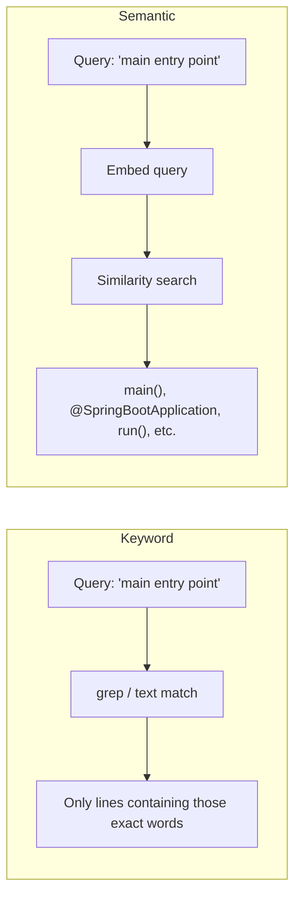
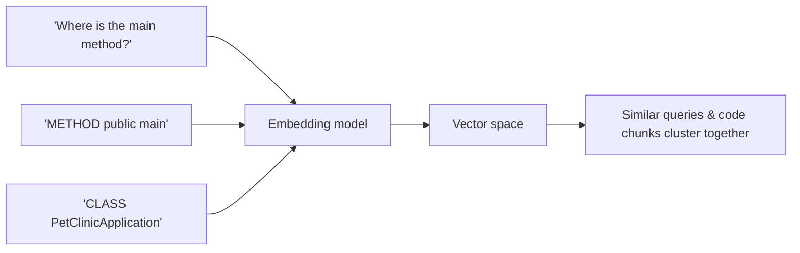
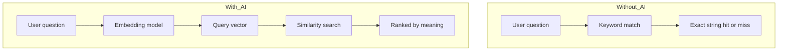
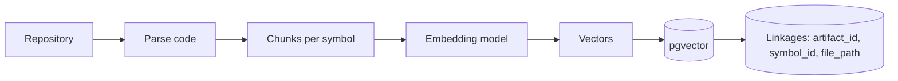
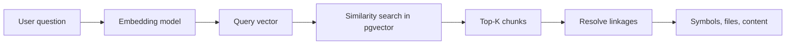
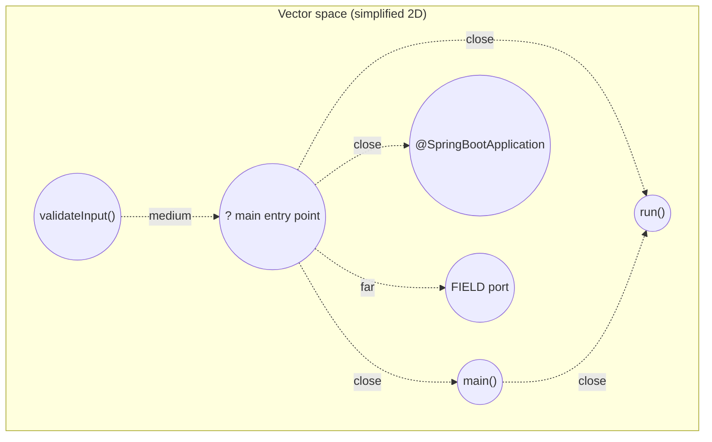
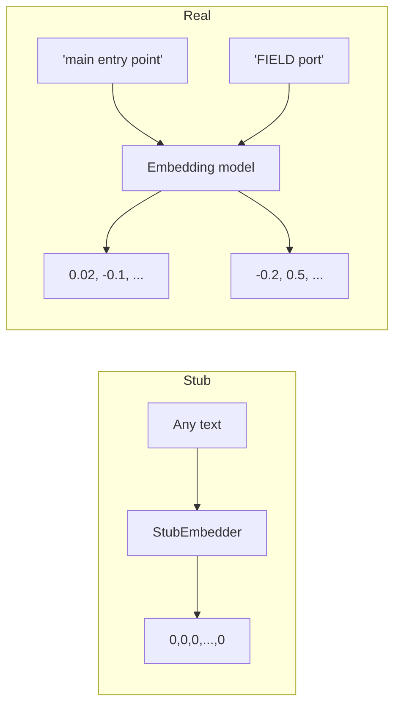
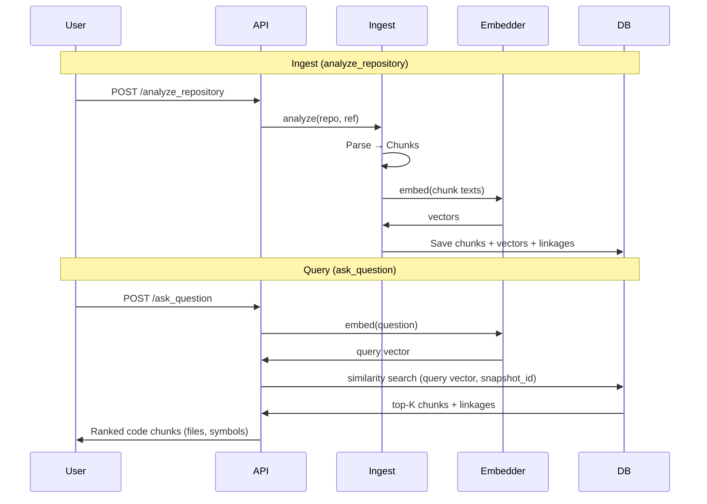

# Embeddings and Why We Use AI to Make Sense of Code

This document explains what embeddings are, how they enable “semantic” understanding of code, and why the code-analyzer-agent uses an AI embedding model (or a stub) to power search and Q&A.

---

## 1. The Problem: Finding Code by Meaning, Not Just Words

When you ask things like:

- *“Where is the main entry point?”*
- *“How does the app validate user input?”*
- *“Where do we handle payment failures?”*

you care about **meaning**, not exact wording. The code might not contain the phrase “main entry point”; it might have a `main(String[] args)` method or a `@SpringBootApplication` class. A **keyword search** (e.g. grep for “main entry point”) often fails or returns too much noise. What we want is **semantic search**: find code that is *about* the same idea, even if the words differ.

**Keyword search** matches strings. **Semantic search** matches *meaning* by comparing **embeddings**—numerical representations of meaning. That’s where the “AI” (embedding model) comes in.

---

## 2. What Is an Embedding?

An **embedding** is a list of numbers (a **vector**) that represents the *meaning* of a piece of text (or code) in a fixed-dimensional space.

- **Input:** A string (e.g. a sentence, a code snippet, or a label like `METHOD public main`).
- **Output:** A vector of fixed length (e.g. 1536 floats). Similar meanings → vectors that are “close” in that space; different meanings → vectors that are “far.”

Think of it as giving every phrase a **position** in a high-dimensional map. Phrases that mean similar things end up near each other; unrelated ones are far apart.

| Text | Role | Vector (conceptually) |
|------|------|------------------------|
| “Where is the main entry point?” | User question | e.g. [0.02, -0.1, 0.3, …] (1536 numbers) |
| “METHOD public main” | Code chunk | e.g. [0.01, -0.09, 0.28, …] (close to the question) |
| “FIELD private port” | Code chunk | e.g. [-0.2, 0.5, 0.1, …] (farther from the question) |

We don’t hand-design these numbers. An **embedding model** (a small neural network trained on huge amounts of text/code) produces them so that “similar meaning” corresponds to “similar vector.”

---

## 3. Why We Need “AI” (an Embedding Model)

Humans can tell that “main entry point” and “public static void main” are about the same idea. Computers, by default, only see characters. So we need a component that has learned **semantic similarity** from data—i.e. a **model** trained with ML/AI.

That model:

1. **Encodes meaning** into vectors so that “same idea” ≈ “close in vector space.”
2. Works for **paraphrases** (“entry point” vs “main method”) and **synonyms** (“validate input” vs “check user data”).
3. Can be trained on **code** (or code + text) so that code snippets and natural-language questions sit in the same space.

So “AI” here means: **we use a learned embedding model to turn text and code into vectors that reflect meaning.** Without it, we only have keyword match; with it, we can do **semantic search** and **make sense** of questions over code.

---

## 4. How an Embedding Model Works (High Level)

Embedding models are usually **neural networks** (e.g. transformers or simpler encoder architectures):

1. **Input:** Tokenized text (words or subwords).
2. **Network:** Multiple layers that combine tokens into a single vector (e.g. by averaging or using a special “[CLS]” token).
3. **Output:** One vector per input (e.g. 1536 dimensions). Training (on large corpora) is done so that:
   - Semantically similar sentences get similar vectors.
   - Dissimilar sentences get different vectors.

Training objectives often include:

- **Predict next sentence** or **predict masked words** (e.g. BERT-style).
- **Contrastive learning:** pull “related” pairs close and “unrelated” pairs apart (e.g. Sentence-BERT, OpenAI embeddings).

For **code**, the same idea applies: the model is trained so that code snippets and natural language that describe the same concept end up with similar embeddings. No need to implement this yourself—we use an **embedding API** (e.g. OpenAI, or an open-source model via Spring AI).

---

## 5. How This App Uses Embeddings

The code-analyzer-agent uses embeddings in two places: **ingest** (when you run `analyze_repository`) and **query** (when you call `ask_question`).

### 5.1 Ingest: Code → Chunks → Vectors → Store

1. **Parse:** Source files are parsed into **symbols** (classes, methods, fields).
2. **Chunk:** Each symbol becomes one **chunk** (short text, e.g. `CLASS public Foo`, `METHOD public run`).
3. **Embed:** The **embedding model** turns each chunk into a vector (e.g. 1536 dimensions).
4. **Store:** Vectors are stored in **PostgreSQL (pgvector)** in the `code_embeddings` table, along with **linkages** (`snapshot_id`, `artifact_id`, `symbol_id`, `file_path`, `span`, `kind`).

The linkages are what let the app go from “this vector was similar” back to “this method in this file.”

### 5.2 Query: Question → Vector → Similarity Search → Results

1. **Embed:** The same embedding model turns the **user question** into a vector.
2. **Search:** The database finds the stored chunk vectors **closest** to the query vector (e.g. cosine similarity, over a given `snapshot_id` or project).
3. **Return:** The app returns those chunks plus their linkages (symbol, file, span) so the user (or another agent) can see *which* code was relevant.

So “making sense” of the question means: **embed it, then find the code chunks whose embeddings are closest to that question.**

---

## 6. Vector Space (Conceptual Diagram)

In reality the space has hundreds of dimensions; below is a 2D simplification.

- **Closeness** = high similarity (e.g. cosine similarity close to 1).
- The embedding model is what places “main entry point,” “main()”, “run()”, and “@SpringBootApplication” near each other, and “FIELD port” farther away.

---

## 7. Stub vs Real Embedding Model

| Aspect | StubEmbedder (current default) | Real embedding model (e.g. OpenAI, local model) |
|--------|--------------------------------|--------------------------------------------------|
| **Output** | Same zero vector for every input | Different vector per meaning |
| **Similarity** | All chunks equally “similar” to every question | Similar meaning → closer vectors |
| **ask_question** | Results are effectively random (no real ranking) | Results are ranked by relevance to the question |
| **Use case** | Run the app without an API key; test ingest and API shape | Real semantic search and Q&A |

So: **we need a real AI embedding model** to actually “make sense” of questions and return meaningfully ranked code. The stub is only for development and testing.

---

## 8. End-to-End Flow in This Application

The **Embedder** is the only component that “understands” meaning; the rest is storage and retrieval. Swapping the stub for a real model (e.g. via Spring AI’s `EmbeddingModel`) is what makes the system semantically aware.

---

## 9. Why Dimensions (e.g. 1536)?

The **dimension** is the length of the vector (number of floats). It’s fixed by the model:

- **Larger** (e.g. 1536): More capacity to encode fine-grained meaning; usually better quality, more storage and slightly more compute.
- **Smaller** (e.g. 384): Faster and cheaper, but may lose nuance.

This app uses **1536** to align with common APIs (e.g. OpenAI `text-embedding-ada-002`). The pgvector table is defined as `vector(1536)`. If you switch to another model, its dimension must match (or you need a new migration and re-embedding).

---

## 10. Summary: Why AI Is Needed

| Without an embedding model (AI) | With an embedding model (AI) |
|--------------------------------|------------------------------|
| Search = keyword/match only | Search = by *meaning* (semantic) |
| “main entry point” doesn’t match “public static void main” | Question and code can be close in vector space |
| No notion of “similar idea” | Similar ideas → similar vectors → findable by similarity search |

So: **we need AI (an embedding model) to turn questions and code into vectors that capture meaning, so the app can “make sense” of a question and return the relevant code.**

---

## 11. References and Further Reading

- **OpenAI Embeddings:** [Embeddings guide](https://platform.openai.com/docs/guides/embeddings) — what they are and how the API works.
- **Sentence-BERT:** [Sentence-BERT paper](https://arxiv.org/abs/1908.10084) — training embeddings so that similar sentences are close.
- **Code embeddings:** CodeBERT, GraphCodeBERT, and similar — embeddings trained on code for search and summarization.
- **pgvector:** [pgvector on GitHub](https://github.com/pgvector/pgvector) — PostgreSQL extension for storing and querying vectors (e.g. cosine similarity, HNSW index).
- **Spring AI:** [Spring AI Reference – Embeddings](https://docs.spring.io/spring-ai/reference/api/embeddings.html) — how to plug in an `EmbeddingModel` (OpenAI or others) in a Spring app.

---

## 12. Glossary

| Term | Meaning |
|------|--------|
| **Embedding** | A fixed-length vector of numbers representing the meaning of a piece of text (or code). |
| **Embedding model** | A trained model (e.g. neural network) that maps text to embeddings. |
| **Semantic search** | Search by meaning (via embedding similarity) instead of by exact keyword. |
| **Similarity** | Usually cosine similarity between two vectors; higher = more similar meaning. |
| **Chunk** | A small unit of code (e.g. one symbol) that we embed and store. |
| **Linkage** | Metadata (artifact_id, symbol_id, file_path, etc.) stored with each embedding so we can map “this vector” back to “this symbol in this file.” |
