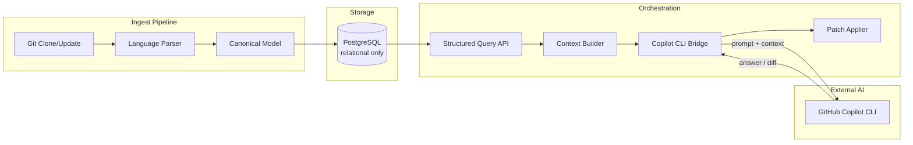
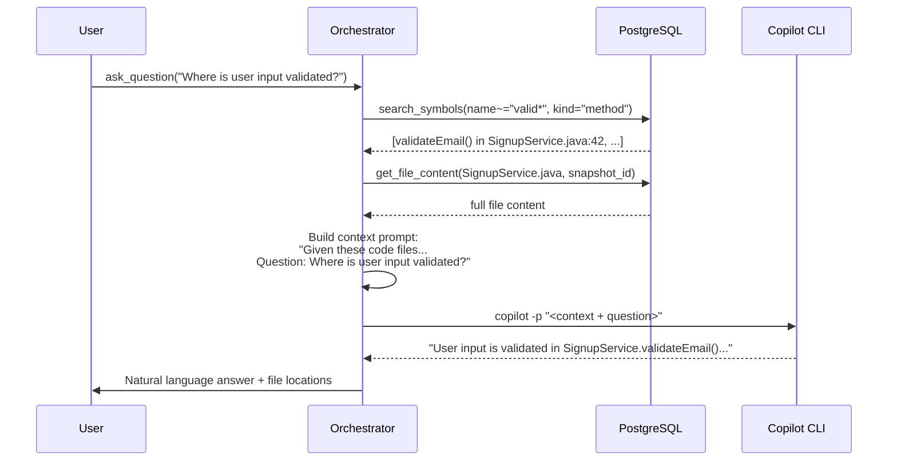
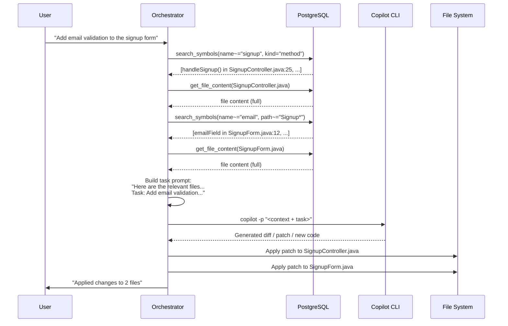
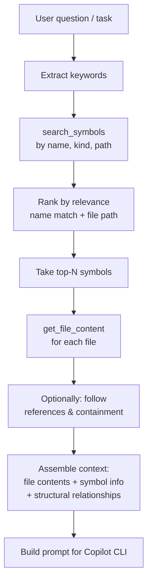
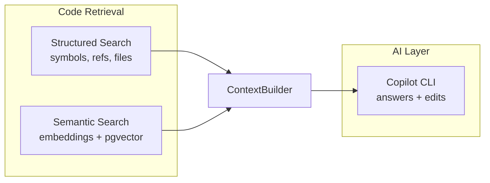

# Alternative Design: Orchestration + Copilot CLI (No Embedded AI)

This document describes an alternative architecture where the code-analyzer
**drops all AI/embedding logic** and becomes a pure **structured code intelligence
backend**. All AI-related work — semantic understanding, question answering, and
code generation/editing — is delegated to **GitHub Copilot CLI** (or a similar
external AI tool). The code-analyzer's role becomes **orchestration**: parse,
store, retrieve structured data, and feed it to Copilot CLI as context.

---

## 1. Core Idea

```
┌────────────────────────────────────────────────────────────┐
│                    SDLC Agent / User                       │
│                                                            │
│  "Add email validation to the signup form"                 │
└──────────────────────────┬─────────────────────────────────┘
                           │
                           ▼
┌────────────────────────────────────────────────────────────┐
│              Orchestration Layer (this app)                 │
│                                                            │
│  1. Parse & store code (relational model only)             │
│  2. Structured search (symbols, refs, containment, files)  │
│  3. Assemble context (code snippets, file contents)        │
│  4. Invoke Copilot CLI with context + prompt               │
│  5. Apply Copilot's output (patches, new files)            │
└──────────────────────────┬─────────────────────────────────┘
                           │
               ┌───────────┴───────────┐
               ▼                       ▼
┌──────────────────────┐  ┌──────────────────────┐
│  PostgreSQL           │  │  Copilot CLI          │
│  (relational only,    │  │  (all AI reasoning,   │
│   no pgvector)        │  │   code gen, Q&A)      │
└──────────────────────┘  └──────────────────────┘
```

**What changes:**

- **Removed:** Embedding model, vector store (pgvector), `SpringAiEmbedder`,
  `StubEmbedder`, `EmbeddingPipeline`, `code_embeddings` table, Spring AI
  embedding dependencies.
- **Kept:** Git clone, parsing, relational schema (snapshots, artifacts,
  symbols, references, containment, file contents), structured query API,
  projects.
- **Added:** Copilot CLI integration layer — the orchestrator calls
  `copilot` (or `gh copilot`) programmatically, feeding it structured context
  from the relational model, and capturing its output.

---

## 2. Architecture



### Components

| Component | Responsibility |
|-----------|---------------|
| **Ingest Pipeline** | Clone repo, parse files, persist relational model (symbols, refs, containment, spans, file contents) to PostgreSQL. No embeddings. |
| **Structured Query API** | Snapshot-scoped reads: search symbols by name/kind/path, find references, get containment tree, get file content. |
| **Context Builder** | Given a user question or task, use the Query API to assemble relevant code snippets, file contents, and structural information into a context payload. |
| **Copilot CLI Bridge** | Invoke Copilot CLI programmatically (`copilot -p "..."` or `gh copilot ...`) with the assembled context + the user's question/task. Capture the response. |
| **Patch Applier** | If Copilot returns code changes (diffs, patches, new file content), apply them to the working tree or return them to the caller. |

---

## 3. Flow: Answering a Question About Code



### How Context Is Built (Without Embeddings)

Since there is no vector similarity search, the orchestrator uses **structured
heuristics** to find relevant code:

1. **Keyword extraction:** Extract key terms from the question (e.g. "validate",
   "user input", "signup").
2. **Symbol search:** `search_symbols(name LIKE '%validate%')` or
   `search_symbols(kind='method', path LIKE '%Signup%')`.
3. **Reference traversal:** If the question mentions a specific symbol, follow
   references and containment to find callers/callees.
4. **File content retrieval:** Fetch full file content for the top matching
   files/symbols.
5. **Assembly:** Combine the snippets into a structured context block that
   Copilot CLI can reason over.

This is **keyword + structural search**, not semantic search. The "semantic
understanding" happens entirely inside Copilot CLI when it reads the assembled
context.

---

## 4. Flow: Making Code Changes



### Key Difference From Current Design

| Aspect | Current (embedded AI) | This design (Copilot CLI) |
|--------|----------------------|---------------------------|
| **Finding relevant code** | Embed question → vector similarity search | Keyword/structural search → feed to Copilot CLI |
| **Understanding the question** | Embedding model (coarse similarity) | Copilot CLI's LLM (full NLU) |
| **Generating answers** | Return raw chunks; SDLC agent synthesizes | Copilot CLI generates the answer directly |
| **Generating code changes** | Not supported (read-only MCP) | Copilot CLI generates diffs; orchestrator applies them |
| **AI dependency** | Spring AI + embedding model (Ollama/Bedrock) | Copilot CLI (external process) |

---

## 5. Detailed Component Design

### 5.1 Context Builder

The Context Builder is the core new component. It replaces the embedding +
vector search pipeline with a **deterministic, structured retrieval** strategy.



**Retrieval strategies** (configurable):

| Strategy | When to use |
|----------|-------------|
| **Name match** | Question mentions a specific symbol or class name. |
| **Path match** | Question mentions a file or directory. |
| **Kind filter** | Question asks about "all controllers" or "all tests". |
| **Reference graph** | Question asks "what calls X?" or "where is Y used?" — traverse references. |
| **Broad scan** | Question is vague — fetch file list, send file names to Copilot CLI, let it choose which to examine. |

### 5.2 Copilot CLI Bridge

Invokes Copilot CLI as a **subprocess** and captures output.

```
Input:  prompt string (context + question/task)
Output: Copilot's response (text answer, or code diff, or structured plan)
```

**Invocation modes:**

- **Programmatic prompt:**  
  `copilot -p "Given this code:\n<context>\n\nQuestion: <question>"` → captures
  stdout as the answer.

- **Plan mode (for edits):**  
  `copilot -p "Given this code:\n<context>\n\nTask: <task>\n\nGenerate a unified diff."` →
  captures the diff output.

- **Delegated (background):**  
  For large tasks, use `& copilot ...` to delegate to the Copilot coding agent
  in the cloud.

**Error handling:**

- Timeout if Copilot CLI doesn't respond within N seconds.
- Parse output to detect errors ("I don't have enough context") and retry
  with broader context.
- Validate diff output before applying.

### 5.3 Patch Applier

Takes Copilot CLI's output and applies it to the filesystem:

- **Unified diff** → `git apply` or programmatic patch.
- **Full file replacement** → write to path.
- **Dry run mode** → show the diff to the user without applying.

---

## 6. What Gets Removed From the Current Codebase

| Current component | Status in this design |
|-------------------|----------------------|
| `SpringAiEmbedder` | **Deleted** |
| `StubEmbedder` | **Deleted** |
| `Embedder` interface | **Deleted** |
| `EmbeddingPipeline` / `DefaultEmbeddingPipeline` | **Deleted** |
| `CodeEmbeddingRepository` / `JdbcCodeEmbeddingRepository` | **Deleted** |
| `code_embeddings` table + V2/V3 migrations | **Deleted** (or left inert) |
| `spring-ai-model` dependency | **Deleted** |
| `spring-ai-starter-model-ollama` dependency | **Deleted** |
| `spring-ai-starter-vector-store-pgvector` dependency | **Deleted** |
| `AskQuestionService` (current: embed + vector search) | **Rewritten** to use Context Builder + Copilot CLI Bridge |
| `application-demo-ollama.yml` / `application-bedrock.yml` | **Deleted** |
| pgvector extension requirement | **Optional** (no longer needed for core) |

| New component | Purpose |
|---------------|---------|
| `ContextBuilder` | Structured retrieval: keyword/symbol/ref search → assembled context |
| `CopilotCliBridge` | Invoke Copilot CLI programmatically, capture response |
| `PatchApplier` | Apply diffs/patches from Copilot CLI to the working tree |
| `AskQuestionService` (rewritten) | Orchestrate: question → ContextBuilder → CopilotCliBridge → answer |
| `EditCodeService` (new) | Orchestrate: task → ContextBuilder → CopilotCliBridge → PatchApplier → result |

---

## 7. Trade-offs

### 7.1 Advantages

- **No embedding infrastructure:** No embedding model to host, configure, or
  pay for. No vector store. No dimension management. Simpler deployment.
- **Better answers:** Copilot CLI uses a full LLM (GPT-5.x) which is far more
  capable at understanding questions and code than a similarity search over
  chunk embeddings. It can reason, explain, and synthesize — not just return
  ranked snippets.
- **Code changes:** Copilot CLI can **generate code**, not just find it. The
  current MCP is read-only; this design can produce and apply edits.
- **Always up to date:** Copilot CLI uses the latest models and capabilities
  from GitHub without you maintaining or upgrading AI dependencies.
- **Simpler codebase:** Remove Spring AI, embedding config, vector store, and
  all related tests/docs. The app becomes purely: parse + store + query +
  orchestrate.

### 7.2 Disadvantages

- **External dependency:** Requires Copilot CLI installed and authenticated.
  Copilot requires a GitHub Copilot subscription. Doesn't work offline or in
  air-gapped environments.
- **Latency:** Each question/task involves a round-trip to Copilot CLI (which
  calls GitHub's API). Slower than a local vector similarity search.
- **Context window limits:** Copilot CLI has a finite context window. For very
  large codebases, you may not be able to feed all relevant files. The Context
  Builder must be smart about what to include.
- **Non-deterministic:** LLM answers vary. Two identical questions may get
  different answers. Vector search is deterministic.
- **Structured retrieval is less precise:** Without embeddings, finding relevant
  code for a vague question (e.g. "how does the app handle errors?") relies on
  keyword matching, which may miss relevant code that doesn't contain those
  keywords. Embeddings catch semantic similarity; keyword search doesn't.
- **Cost:** Copilot subscription cost vs hosting your own embedding model
  (which can be free with Ollama).

### 7.3 When Each Approach Wins

| Scenario | Embedded AI (current) | Copilot CLI (this design) |
|----------|----------------------|---------------------------|
| Offline / air-gapped | Works with local Ollama | Does not work |
| Vague semantic questions | Good (embedding similarity) | Depends on context builder quality |
| Precise "where is X?" | Good (structured search exists too) | Equally good |
| Generating code changes | Cannot do this | Can do this |
| Answer quality / explanation | Returns raw chunks only | Full prose answers |
| Cost (hobby/small team) | Free with Ollama | Copilot subscription (~$10–19/mo) |
| Large codebase (1M LOC) | Scales with vector index | Limited by context window |
| Deployment simplicity | Needs embedding model + pgvector | Needs Copilot CLI installed |

---

## 8. Hybrid Option: Keep Both

A pragmatic middle ground:



- Keep the embedding pipeline for **retrieval** (finding relevant code chunks
  via semantic similarity).
- But instead of returning raw chunks to the user, feed them into **Copilot
  CLI** for synthesis, explanation, and code generation.
- Best of both worlds: semantic retrieval precision + LLM reasoning + code
  editing capability.

This is essentially the **RAG pattern** where retrieval is your existing
embedding search and generation is Copilot CLI.

---

## 9. Implementation Roadmap (If Adopting Pure Copilot CLI Design)

| Phase | Work |
|-------|------|
| **1. Context Builder** | Implement keyword extraction, symbol search, file content assembly. Test with sample questions. |
| **2. Copilot CLI Bridge** | Implement subprocess invocation of `copilot -p`, output parsing, error handling, timeout. |
| **3. Rewrite AskQuestionService** | Replace embed+vector search with ContextBuilder + CopilotCliBridge. |
| **4. Add EditCodeService** | New service: task → context → Copilot → diff → apply. |
| **5. Expose via MCP** | Add `edit_code` tool alongside existing `ask_question`. |
| **6. Remove AI dependencies** | Delete Spring AI, embedding classes, vector store, pgvector config. |
| **7. Update docs and tests** | Rewrite embedding docs, remove embedding specs, add Copilot integration tests. |

---

## 10. Decision

This document presents an **alternative**, not a replacement. The choice depends
on your priorities:

- **If you want self-contained, offline-capable semantic search** → keep the
  current embedded AI design (or the hybrid option).
- **If you want the best possible answers and code-editing capability, and
  are OK depending on Copilot CLI** → adopt this design.
- **If you want both** → use the hybrid option (Section 8): embedded retrieval
  for finding code, Copilot CLI for reasoning and editing.
