# SDLC Orchestrator Design: Jira-to-PR via Copilot CLI

This document is the engineering blueprint for expanding the code-analyzer-agent into a
full **SDLC orchestrator**. The orchestrator picks up a Jira story, uses the existing
code-analyzer for codebase understanding, delegates all AI work (planning, code
generation, test fixing, self-review) to **GitHub Copilot CLI**, manages **persistent
context/memory** across tasks, runs tests, and opens a Pull Request -- optionally with
human-in-the-loop checkpoints.

---

## 1. End-to-End Architecture

### 1.1 Component Overview

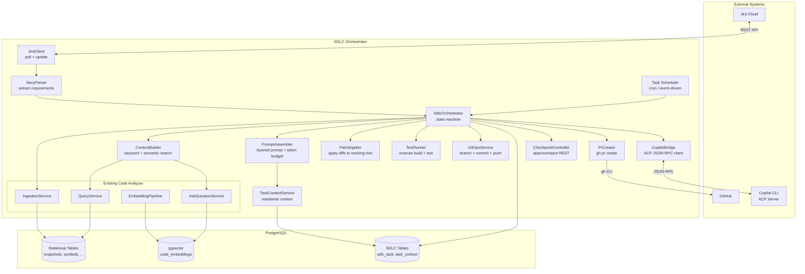

### 1.2 Human-in-the-Loop vs Autonomous

The orchestrator supports two autonomy modes, configurable per-task or globally.

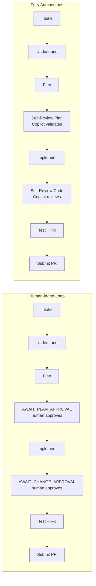

In autonomous mode, the two human checkpoints are replaced by **Copilot self-review**
prompts. The self-review asks Copilot to critique its own plan/code and either proceed
or revise. The PR itself still goes through normal human code review on GitHub.

---

## 2. Task Lifecycle State Machine

The `SdlcOrchestrator` drives each task through a formal state machine. Every
transition is persisted to `sdlc_task.status` so the orchestrator can resume after
restarts.

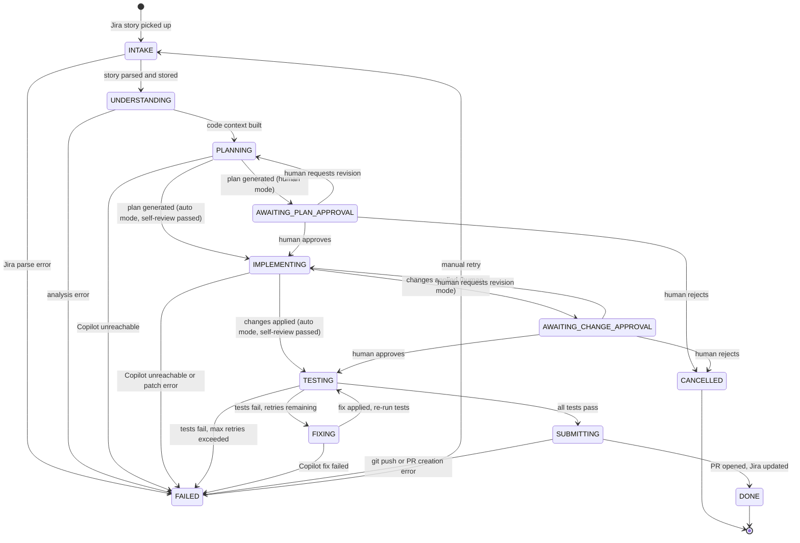

### State Descriptions

| State | Description | Exit condition |
|-------|-------------|----------------|
| INTAKE | Jira story fetched and parsed | Story context written to `task_context` |
| UNDERSTANDING | Code analyzer ingests/searches the repo | Code context written to `task_context` |
| PLANNING | Copilot CLI generates an implementation plan | Plan stored; checkpoint or auto-proceed |
| AWAITING_PLAN_APPROVAL | Paused; waiting for human approval via REST | Human calls approve/revise/reject endpoint |
| IMPLEMENTING | Copilot CLI generates code changes; PatchApplier applies them | Changes applied; checkpoint or auto-proceed |
| AWAITING_CHANGE_APPROVAL | Paused; waiting for human approval via REST | Human calls approve/revise/reject endpoint |
| TESTING | Test command executed | Tests pass or fail |
| FIXING | Copilot CLI generates a fix for test failures | Fix applied; returns to TESTING |
| SUBMITTING | Branch created, committed, pushed; PR opened; Jira updated | PR URL stored |
| DONE | Terminal success state | -- |
| FAILED | Terminal failure state (retryable) | Manual retry resets to INTAKE |
| CANCELLED | Terminal state; human rejected the task | -- |

### Retry and Escalation

- **Test retries**: configurable `sdlc.test.max-retries` (default 3). Each TESTING->FIXING->TESTING cycle increments a counter stored on `sdlc_task`.
- **Copilot retries**: if Copilot ACP is unreachable, the bridge retries with exponential backoff (1s, 2s, 4s) up to 3 times before marking FAILED.
- **Manual retry**: a FAILED task can be retried via `POST /api/sdlc/tasks/{id}/retry`, which resets status to INTAKE and clears stale context.

---

## 3. Extended Data Model

### 3.1 ER Diagram

The two new tables integrate with the existing schema via foreign keys to `snapshots`
and logically relate to `projects`.

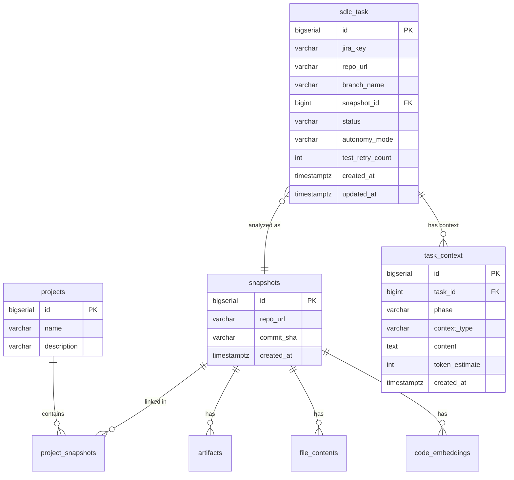

### 3.2 DDL

```sql
-- V4: SDLC orchestrator tables
CREATE TABLE sdlc_task (
    id                BIGSERIAL    PRIMARY KEY,
    jira_key          VARCHAR(32)  NOT NULL,
    repo_url          VARCHAR(512) NOT NULL,
    branch_name       VARCHAR(256),
    snapshot_id       BIGINT       REFERENCES snapshots(id),
    status            VARCHAR(32)  NOT NULL DEFAULT 'INTAKE',
    autonomy_mode     VARCHAR(16)  NOT NULL DEFAULT 'human',
    test_retry_count  INT          NOT NULL DEFAULT 0,
    created_at        TIMESTAMPTZ  NOT NULL DEFAULT now(),
    updated_at        TIMESTAMPTZ  NOT NULL DEFAULT now()
);

CREATE TABLE task_context (
    id              BIGSERIAL    PRIMARY KEY,
    task_id         BIGINT       NOT NULL REFERENCES sdlc_task(id) ON DELETE CASCADE,
    phase           VARCHAR(32)  NOT NULL,
    context_type    VARCHAR(32)  NOT NULL,
    content         TEXT         NOT NULL,
    token_estimate  INT,
    created_at      TIMESTAMPTZ  NOT NULL DEFAULT now()
);

CREATE INDEX idx_sdlc_task_jira       ON sdlc_task(jira_key);
CREATE INDEX idx_sdlc_task_repo       ON sdlc_task(repo_url);
CREATE INDEX idx_sdlc_task_status     ON sdlc_task(status);
CREATE INDEX idx_task_context_task    ON task_context(task_id);
CREATE INDEX idx_task_context_phase   ON task_context(task_id, phase);
```

### 3.3 Enumerations

**Task status** values:

`INTAKE`, `UNDERSTANDING`, `PLANNING`, `AWAITING_PLAN_APPROVAL`, `IMPLEMENTING`,
`AWAITING_CHANGE_APPROVAL`, `TESTING`, `FIXING`, `SUBMITTING`, `DONE`, `FAILED`,
`CANCELLED`

**Phase** values (for `task_context.phase`):

`INTAKE`, `UNDERSTAND`, `PLAN`, `IMPLEMENT`, `TEST`, `FIX`, `REVIEW`, `SUBMIT`

**Context type** values (for `task_context.context_type`):

| Type | Description | Typical producer |
|------|-------------|-----------------|
| STORY | Jira summary, description, acceptance criteria, labels | StoryParser |
| CODE_CONTEXT | Relevant symbols, file snippets, structural info | ContextBuilder |
| HISTORICAL | Condensed context from past tasks on same repo | TaskContextService |
| PLAN | Implementation plan generated by Copilot | Copilot (PLAN phase) |
| DIFF | Generated patches or file edits | Copilot (IMPLEMENT phase) |
| TEST_RESULT | Test pass/fail output | TestRunner |
| FIX_DIFF | Corrective patch for test failure | Copilot (FIX phase) |
| SELF_REVIEW | Copilot's self-review critique (auto mode) | Copilot (auto checkpoints) |
| PR_URL | GitHub PR URL | PrCreator |
| REPO_SUMMARY | Condensed knowledge base for a repo (cross-task) | Condensation job |

---

## 4. Phase-by-Phase Sequence Diagrams

### 4.1 Intake Phase

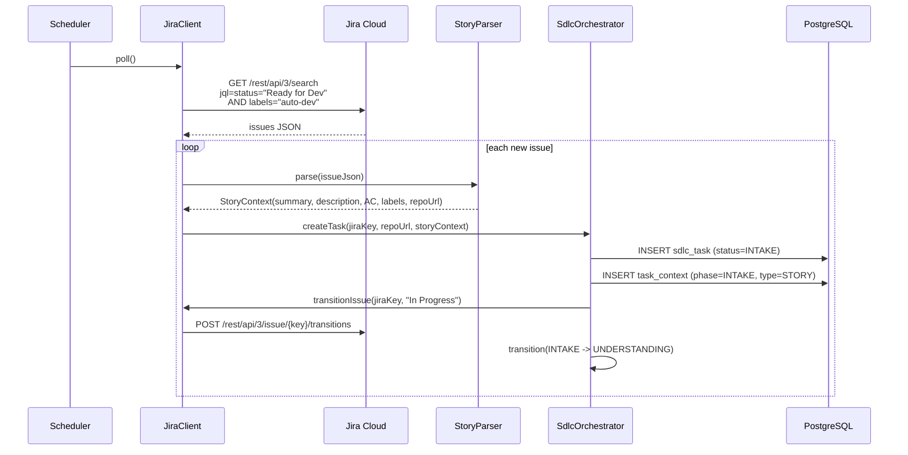

### 4.2 Understand Phase

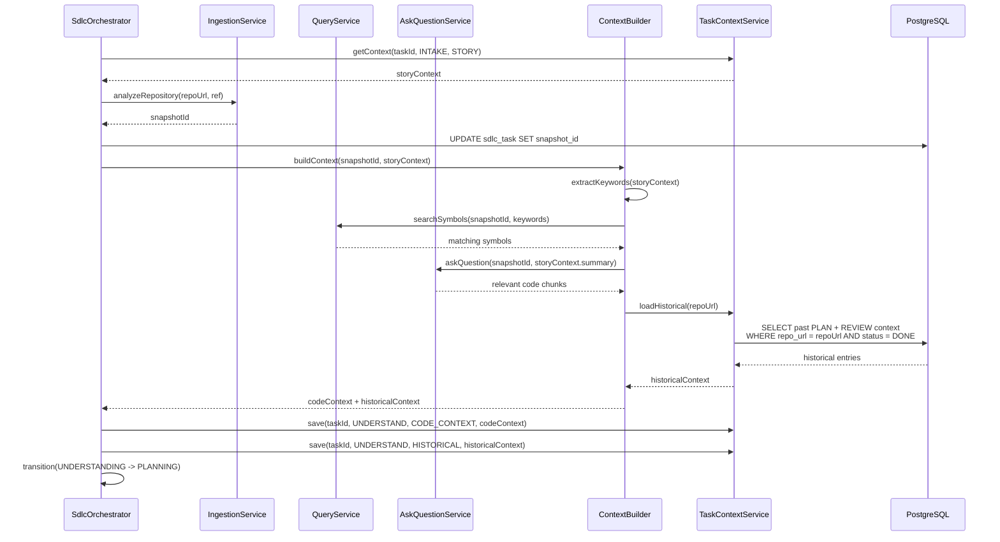

### 4.3 Plan Phase

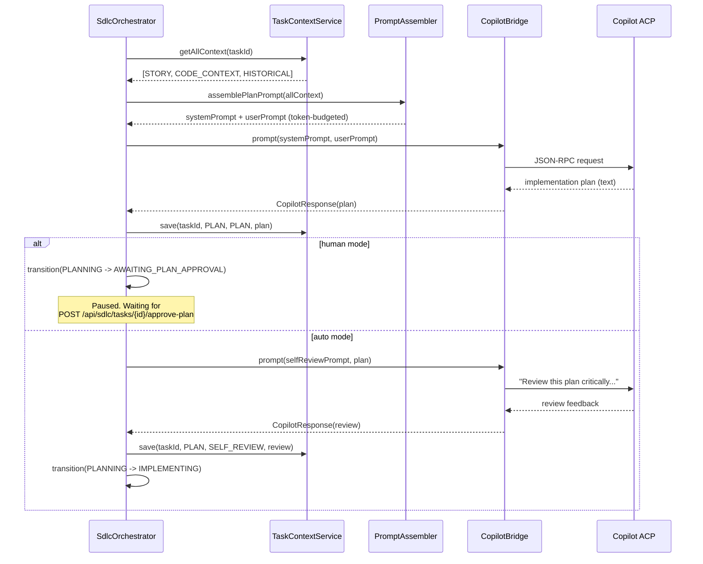

### 4.4 Implement Phase

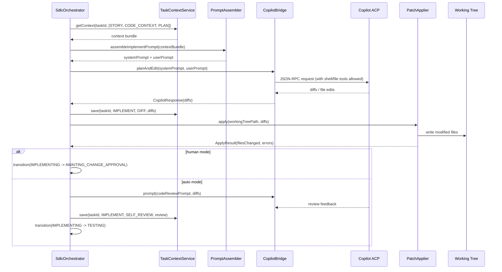

### 4.5 Test and Fix Loop

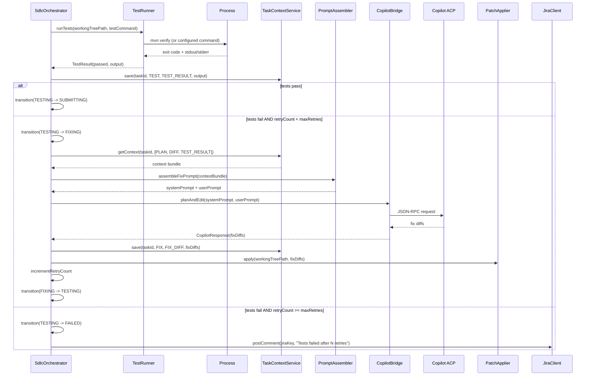

### 4.6 Submit Phase

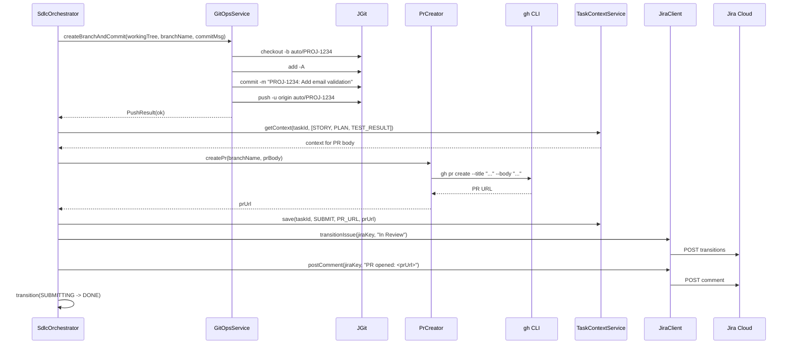

---

## 5. Context Memory Deep Dive

### 5.1 Layered Prompt Construction

Every Copilot CLI invocation receives a prompt assembled from multiple layers.
The `PromptAssembler` fills layers in priority order within a configurable token budget.

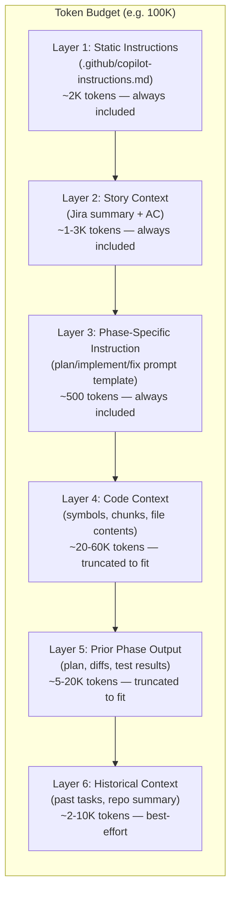

**Token budget algorithm:**

1. Reserve space for layers 1-3 (fixed, small).
2. Allocate remaining budget to layers 4-6 in a 60/25/15 ratio.
3. If a layer's content exceeds its allocation, truncate by relevance ranking
   (most relevant symbols/chunks first; most recent historical entries first).
4. `task_context.token_estimate` is computed on write using a simple heuristic
   (character count / 4) to avoid re-tokenizing on every prompt assembly.

### 5.2 Cross-Task Memory Flow

The historical context mechanism allows the orchestrator to learn from past tasks.

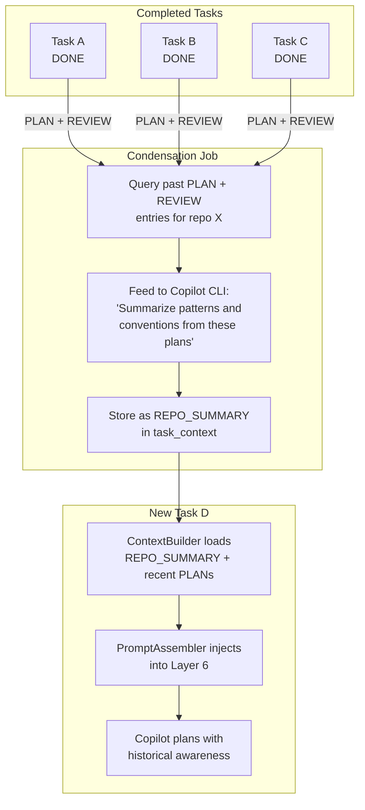

### 5.3 Context Condensation Sequence

A scheduled job (e.g. nightly) condenses accumulated context into a compact repo
knowledge base.

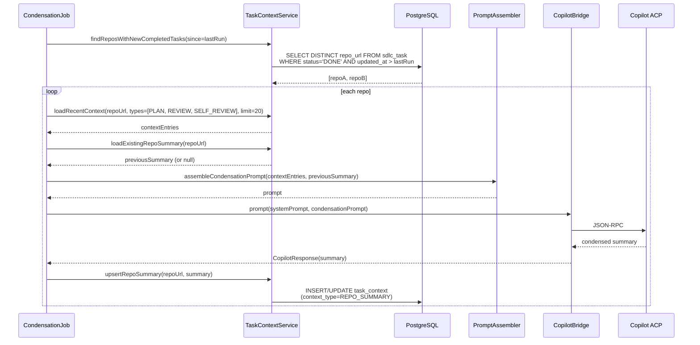

### 5.4 Context Type Reference

| Type | Producer | Consumer phases | Retention |
|------|----------|----------------|-----------|
| STORY | StoryParser (INTAKE) | UNDERSTAND, PLAN, IMPLEMENT, SUBMIT | Permanent |
| CODE_CONTEXT | ContextBuilder (UNDERSTAND) | PLAN, IMPLEMENT | Permanent |
| HISTORICAL | TaskContextService (UNDERSTAND) | PLAN | Refreshed per task |
| PLAN | Copilot (PLAN) | IMPLEMENT, TEST, FIX, SUBMIT | Permanent |
| DIFF | Copilot (IMPLEMENT) | TEST, FIX, SUBMIT | Permanent |
| TEST_RESULT | TestRunner (TEST) | FIX, SUBMIT | Permanent |
| FIX_DIFF | Copilot (FIX) | TEST (retry) | Permanent |
| SELF_REVIEW | Copilot (auto checkpoints) | Next phase | Permanent |
| PR_URL | PrCreator (SUBMIT) | -- | Permanent |
| REPO_SUMMARY | CondensationJob | UNDERSTAND (next task) | Updated nightly |

---

## 6. Copilot CLI Integration Detail

### 6.1 ACP Server Lifecycle

The orchestrator manages the Copilot CLI process as an ACP server.

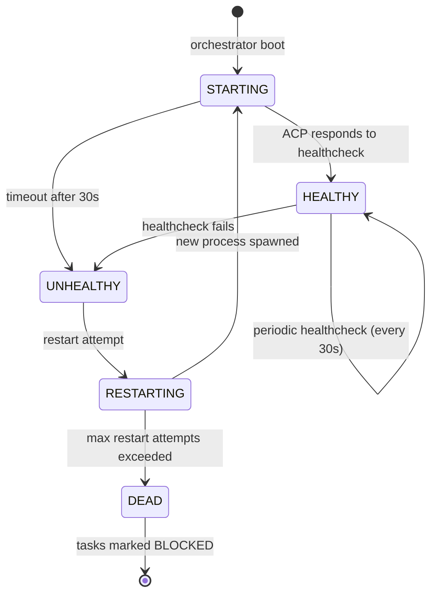

**Startup command:**

```
copilot --acp --port 3000 \
  --allow-tool='shell(mvn,gradle,npm,git)' \
  --deny-tool='shell(rm,curl,wget)'
```

### 6.2 ACP Request/Response Cycle

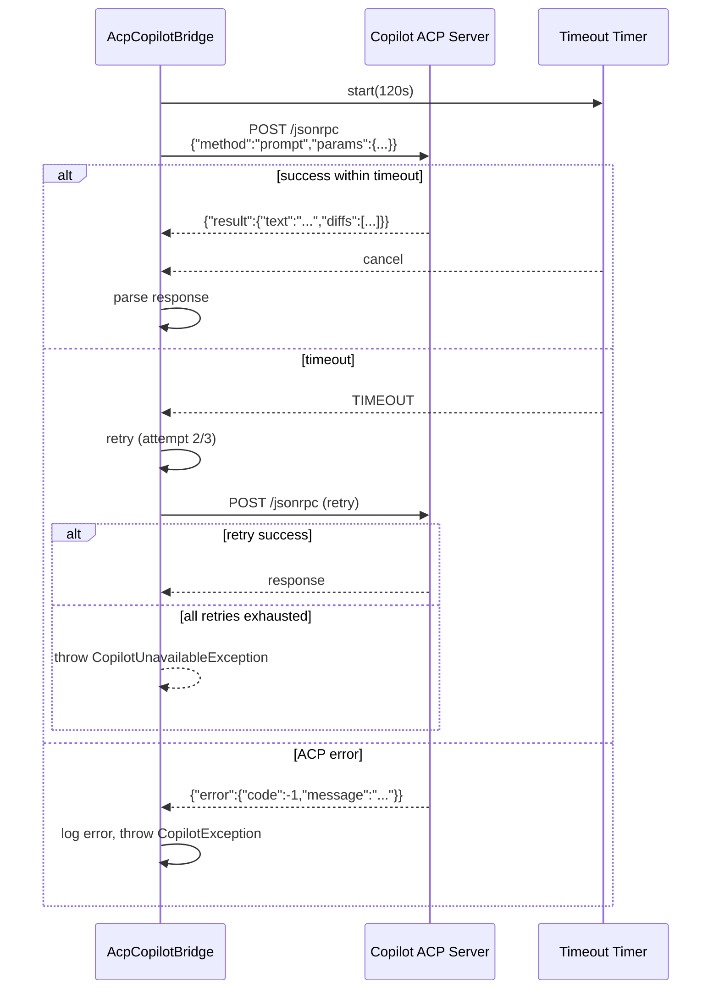

### 6.3 Bridge Interface and Implementations

```java
public interface CopilotBridge {

    CopilotResponse prompt(String systemPrompt, String userPrompt,
                           Set<String> allowedTools);

    CopilotResponse planAndEdit(String systemPrompt, String userPrompt);

    boolean isHealthy();
}
```

```java
public class AcpCopilotBridge implements CopilotBridge {
    // Talks to Copilot CLI running as ACP server via JSON-RPC over HTTP.
    // Preferred for production: persistent process, structured I/O.
    private final RestClient restClient;
    private final int port;
    private final Duration timeout;
    // ...
}
```

```java
public class CliCopilotBridge implements CopilotBridge {
    // Shells out to `copilot -p "..." --allow-all-tools`.
    // Simpler, for local dev/testing. New process per invocation.
    // Parses stdout for text and diffs.
    // ...
}
```

### 6.4 Prompt Templates

**Plan phase:**

```
SYSTEM:
You are an expert software engineer. You are given a Jira story and relevant code
from the repository. Create a detailed, step-by-step implementation plan.

Include:
- Which files to modify or create
- What changes to make in each file
- What tests to add or update
- Any migration or configuration changes

Respect the project conventions described below.

<project-conventions>
{staticInstructions}
</project-conventions>

USER:
## Jira Story
{storySummary}

## Acceptance Criteria
{acceptanceCriteria}

## Relevant Code
{codeContext}

## Historical Patterns (from past tasks on this repo)
{historicalContext}

## Task
Create an implementation plan for the story above.
```

**Implement phase:**

```
SYSTEM:
You are an expert software engineer. Implement the following plan by generating
the exact code changes needed. Output each change as a unified diff.

USER:
## Plan
{plan}

## Current Code (files to modify)
{fileContents}

## Task
Generate unified diffs for all files that need to change.
Output ONLY the diffs, no explanation.
```

**Fix phase:**

```
SYSTEM:
You are an expert software engineer. Tests are failing after the recent changes.
Analyze the test output and fix the code.

USER:
## Implementation Plan
{plan}

## Changes Made
{diffs}

## Test Failure Output
{testOutput}

## Task
Fix the failing tests. Output unified diffs for the corrected files.
```

**Self-review (auto mode):**

```
SYSTEM:
You are a senior code reviewer. Critically review the following plan/code.
Flag any issues: missing edge cases, incorrect logic, security concerns,
convention violations, missing tests.

If the plan/code is acceptable, respond with "APPROVED".
If changes are needed, respond with "REVISE:" followed by specific feedback.

USER:
{planOrDiffs}
```

---

## 7. Jira Integration Detail

### 7.1 Polling and Extraction Sequence

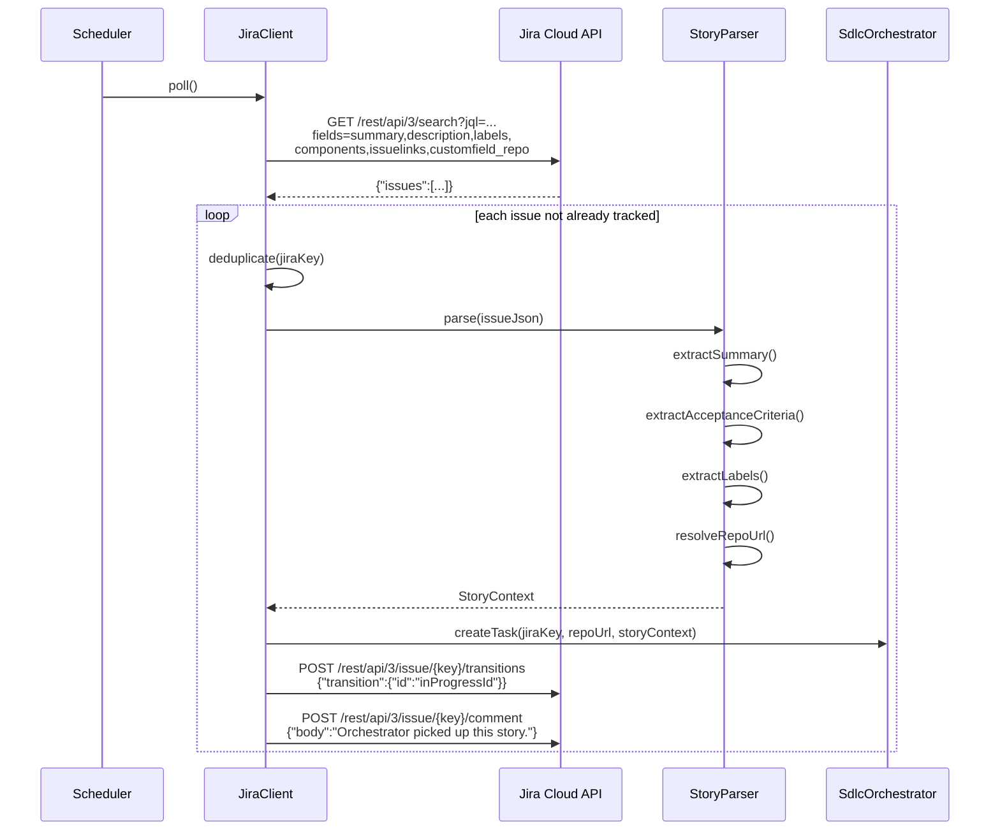

### 7.2 Jira Field Mapping

| Jira field | Maps to | Notes |
|------------|---------|-------|
| `summary` | `StoryContext.summary` | Short description of the story |
| `description` | `StoryContext.description` | Full body; may contain AC |
| `description` (parsed) | `StoryContext.acceptanceCriteria` | Extract lines after "Acceptance Criteria" heading |
| `labels` | `StoryContext.labels` | Used for routing and context |
| `components` | `StoryContext.components` | Maps to code areas |
| `issuelinks` | `StoryContext.linkedIssues` | Related stories, blockers |
| `customfield_10100` (example) | `StoryContext.repoUrl` | Custom field for repo URL; alternatively mapped from project key in config |

### 7.3 Jira Workflow Mapping

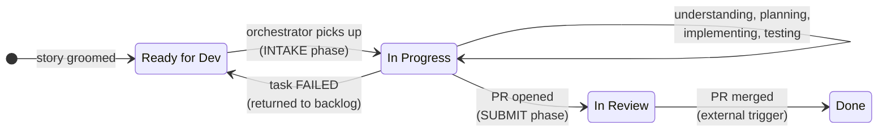

The orchestrator triggers transitions at two points:
1. **Ready for Dev -> In Progress**: when the task enters INTAKE.
2. **In Progress -> In Review**: when the PR is opened (SUBMITTING -> DONE).

The **In Review -> Done** transition happens outside the orchestrator (when the PR
is merged by a human reviewer). Optionally, a GitHub webhook can trigger this.

---

## 8. Git and PR Workflow

### 8.1 Branch, Commit, Push, PR

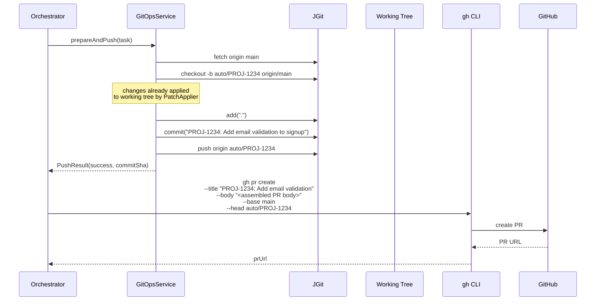

### 8.2 PR Body Template

The PR body is assembled from context:

```markdown
## PROJ-1234: Add email validation to signup

### Jira Story
[PROJ-1234](https://your-org.atlassian.net/browse/PROJ-1234)

{story.summary}

### Implementation Plan
{plan — condensed to first 500 words}

### Changes
{list of files changed with one-line description each}

### Test Results
All tests passing ({testResult.passCount} passed, 0 failed).
{if retries > 0: "Note: {retryCount} test fix iterations were needed."}

---
*This PR was generated by the SDLC Orchestrator.*
```

### 8.3 Conflict Handling

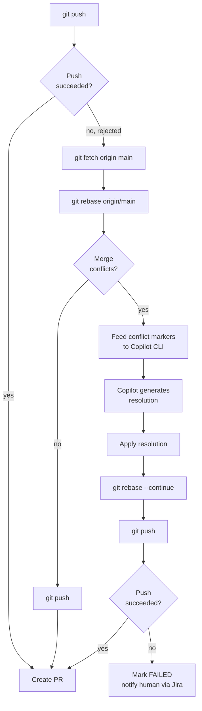

---

## 9. Package and Class Map

### 9.1 Class Diagram

```mermaid
classDiagram
    direction TB

    class SdlcOrchestrator {
        -SdlcTaskRepository taskRepo
        -TaskContextService ctxSvc
        -JiraClient jiraClient
        -ContextBuilder contextBuilder
        -PromptAssembler promptAssembler
        -CopilotBridge copilotBridge
        -PatchApplier patchApplier
        -TestRunner testRunner
        -GitOpsService gitOps
        -PrCreator prCreator
        +processTask(taskId) void
        +approveplan(taskId) void
        +approveChanges(taskId) void
        +retryTask(taskId) void
    end

    class TaskContextService {
        -TaskContextRepository repo
        +save(taskId, phase, type, content) void
        +getContext(taskId, phase, type) String
        +getAllContext(taskId) List
        +loadHistorical(repoUrl) List
        +upsertRepoSummary(repoUrl, summary) void
        +estimateTokens(content) int
    end

    class PromptAssembler {
        -TaskContextService ctxSvc
        -int maxPromptTokens
        +assemblePlanPrompt(taskId) PromptPair
        +assembleImplementPrompt(taskId) PromptPair
        +assembleFixPrompt(taskId) PromptPair
        +assembleReviewPrompt(taskId) PromptPair
        +assembleCondensationPrompt(entries) PromptPair
    }

    class CopilotBridge {
        <<interface>>
        +prompt(system, user, tools) CopilotResponse
        +planAndEdit(system, user) CopilotResponse
        +isHealthy() boolean
    }

    class AcpCopilotBridge {
        -RestClient restClient
        -int port
        -Duration timeout
    }

    class CliCopilotBridge {
        -String copilotPath
        -Duration timeout
    }

    class JiraClient {
        -RestClient restClient
        -String baseUrl
        -String apiToken
        +poll() List~StoryContext~
        +transitionIssue(key, status) void
        +postComment(key, body) void
    }

    class StoryParser {
        +parse(issueJson) StoryContext
    }

    class ContextBuilder {
        -QueryService queryService
        -AskQuestionService askService
        -TaskContextService ctxSvc
        +buildContext(snapshotId, story) CodeContext
    }

    class PatchApplier {
        +apply(workingTree, diffs) ApplyResult
    }

    class TestRunner {
        -String testCommand
        +runTests(workingTree) TestResult
    }

    class GitOpsService {
        +createBranchAndCommit(tree, branch, msg) PushResult
    }

    class PrCreator {
        +createPr(branch, body) String
    }

    CopilotBridge <|.. AcpCopilotBridge
    CopilotBridge <|.. CliCopilotBridge

    SdlcOrchestrator --> TaskContextService
    SdlcOrchestrator --> PromptAssembler
    SdlcOrchestrator --> CopilotBridge
    SdlcOrchestrator --> JiraClient
    SdlcOrchestrator --> ContextBuilder
    SdlcOrchestrator --> PatchApplier
    SdlcOrchestrator --> TestRunner
    SdlcOrchestrator --> GitOpsService
    SdlcOrchestrator --> PrCreator

    PromptAssembler --> TaskContextService
    ContextBuilder --> TaskContextService
    JiraClient --> StoryParser
```

### 9.2 Package Layout

```
com.vajrapulse.agents.codeanalyzer.sdlc/
├── SdlcOrchestrator.java          # state machine, drives task through phases
├── SdlcTask.java                   # entity: one SDLC task row
├── TaskContext.java                 # entity: one context entry row
├── SdlcTaskRepository.java         # JDBC repository for sdlc_task
├── TaskContextRepository.java      # JDBC repository for task_context
├── TaskContextService.java         # context CRUD, historical loading, token estimation
├── TaskStatus.java                 # enum: INTAKE, UNDERSTANDING, ..., DONE, FAILED
├── ContextType.java                # enum: STORY, CODE_CONTEXT, PLAN, DIFF, ...
├── Phase.java                      # enum: INTAKE, UNDERSTAND, PLAN, IMPLEMENT, ...
│
├── intake/
│   ├── JiraClient.java             # Jira REST API: poll, transition, comment
│   ├── StoryParser.java            # parse Jira issue JSON into StoryContext
│   └── StoryContext.java           # DTO: summary, description, AC, labels, repoUrl
│
├── copilot/
│   ├── CopilotBridge.java          # interface: prompt, planAndEdit, isHealthy
│   ├── AcpCopilotBridge.java       # impl: JSON-RPC over HTTP to ACP server
│   ├── CliCopilotBridge.java       # impl: shell out to `copilot -p`
│   ├── CopilotResponse.java        # DTO: text, diffs, error
│   ├── PromptAssembler.java        # build layered prompts with token budgeting
│   └── PromptPair.java             # DTO: systemPrompt + userPrompt
│
├── implement/
│   ├── PatchApplier.java           # apply unified diffs to working tree
│   ├── ApplyResult.java            # DTO: filesChanged, errors
│   ├── TestRunner.java             # execute test command, capture output
│   └── TestResult.java             # DTO: passed, exitCode, output
│
└── submit/
    ├── GitOpsService.java          # JGit: branch, commit, push
    ├── PushResult.java             # DTO: success, commitSha, errors
    └── PrCreator.java              # gh pr create, return PR URL
```

Additional files:

```
com.vajrapulse.agents.codeanalyzer.config/
└── SdlcConfig.java                 # @ConfigurationProperties for sdlc.*

com.vajrapulse.agents.codeanalyzer.mcp/
└── SdlcController.java             # REST endpoints: tasks, approve, retry
```

```
src/main/resources/
├── db/migration/
│   └── V4__sdlc_orchestrator_tables.sql
└── application-sdlc.yml            # SDLC-specific profile config
```

---

## 10. Configuration Reference

### 10.1 Full Configuration Block

```yaml
sdlc:
  enabled: false

  autonomy-mode: human              # human | auto

  jira:
    base-url: https://your-org.atlassian.net
    api-token: ${JIRA_API_TOKEN}
    username: ${JIRA_USERNAME}
    project-key: PROJ
    intake-status: "Ready for Dev"
    intake-label: auto-dev
    poll-interval-seconds: 60
    repo-url-field: customfield_10100   # Jira custom field for repo URL
    # Alternatively, static mapping:
    # repo-url-map:
    #   PROJ: https://github.com/org/repo

  copilot:
    mode: acp                        # acp | cli
    acp-port: 3000
    acp-startup-command: >-
      copilot --acp --port 3000
      --allow-tool='shell(mvn,gradle,npm,git)'
      --deny-tool='shell(rm,curl,wget)'
    timeout-seconds: 120
    max-retries: 3
    max-prompt-tokens: 100000

  test:
    command: "mvn verify"
    max-retries: 3
    timeout-seconds: 600

  git:
    branch-prefix: "auto/"
    commit-message-template: "{jiraKey}: {storySummary}"
    base-branch: main
    working-directory: ${java.io.tmpdir}/sdlc-workspaces

  condensation:
    enabled: true
    cron: "0 2 * * *"               # nightly at 2 AM
    max-entries-per-repo: 20
```

### 10.2 Spring Profile Strategy

The SDLC orchestrator is activated via the `sdlc` profile:

```
# Enable the orchestrator
SPRING_PROFILES_ACTIVE=demo-ollama,sdlc

# Or in application.yml:
spring:
  profiles:
    default: ${SPRING_PROFILES_DEFAULT:demo-ollama}
```

When `sdlc.enabled=false` (the default), all SDLC beans are excluded via
`@ConditionalOnProperty(name = "sdlc.enabled", havingValue = "true")`.
This ensures the existing code-analyzer functionality is completely unaffected.

---

## 11. Incremental Implementation Roadmap

### 11.1 Timeline

```mermaid
gantt
    title SDLC Orchestrator — 10-Week Roadmap
    dateFormat  YYYY-MM-DD
    axisFormat  %b %d

    section Foundation
    Inc 0 Data Model + Lifecycle  :inc0, 2026-03-16, 7d

    section Integrations
    Inc 1 Copilot CLI Bridge      :inc1, after inc0, 7d
    Inc 2 Jira Integration        :inc2, after inc0, 7d

    section Core Phases
    Inc 3 Understand Phase        :inc3, after inc1, 7d
    Inc 4 Plan Phase              :inc4, after inc3, 7d
    Inc 5 Implement Phase         :inc5, after inc4, 7d

    section Test and Ship
    Inc 6 Test + Fix Loop         :inc6, after inc5, 7d
    Inc 7 PR Submission           :inc7, after inc6, 7d

    section Memory and Polish
    Inc 8 Cross-Task Memory       :inc8, after inc7, 7d
    Inc 9 Polish + Hardening      :inc9, after inc8, 7d
```

Note: Increments 1 and 2 can run in parallel since they are independent.

### 11.2 Per-Increment Detail

#### Increment 0: Data Model and Task Lifecycle

| Attribute | Detail |
|-----------|--------|
| **Scope** | Flyway migration, entity classes, repositories, state machine skeleton |
| **New files** | `V4__sdlc_orchestrator_tables.sql`, `SdlcTask.java`, `TaskContext.java`, `SdlcTaskRepository.java`, `TaskContextRepository.java`, `TaskContextService.java`, `SdlcOrchestrator.java` (skeleton), `TaskStatus.java`, `ContextType.java`, `Phase.java` |
| **Tests** | `SdlcTaskRepositorySpec.groovy`, `TaskContextRepositorySpec.groovy`, `TaskContextServiceSpec.groovy`, `SdlcOrchestratorSpec.groovy` (state transitions only) |
| **Definition of done** | Can create a task, write/read context entries, transition through all states; all unit tests pass |
| **Depends on** | None |

#### Increment 1: Copilot CLI Bridge

| Attribute | Detail |
|-----------|--------|
| **Scope** | CopilotBridge interface, ACP and CLI implementations, PromptAssembler with token budgeting |
| **New files** | `CopilotBridge.java`, `AcpCopilotBridge.java`, `CliCopilotBridge.java`, `CopilotResponse.java`, `PromptAssembler.java`, `PromptPair.java` |
| **Tests** | `CliCopilotBridgeSpec.groovy` (mock process), `PromptAssemblerSpec.groovy` (token budget, layer truncation) |
| **Definition of done** | Can send a prompt to Copilot CLI (via ACP or shell) and receive a response; PromptAssembler correctly truncates within budget |
| **Depends on** | Increment 0 (for TaskContextService used by PromptAssembler) |

#### Increment 2: Jira Integration

| Attribute | Detail |
|-----------|--------|
| **Scope** | JiraClient, StoryParser, INTAKE phase wiring |
| **New files** | `JiraClient.java`, `StoryParser.java`, `StoryContext.java`, `SdlcConfig.java` (Jira properties) |
| **Tests** | `JiraClientSpec.groovy` (mock HTTP), `StoryParserSpec.groovy` (sample JSON), `SdlcOrchestratorIntakeSpec.groovy` |
| **Definition of done** | Scheduler polls Jira, creates tasks, stores STORY context, transitions Jira status |
| **Depends on** | Increment 0 |

#### Increment 3: Understand Phase

| Attribute | Detail |
|-----------|--------|
| **Scope** | ContextBuilder, historical context loading, UNDERSTAND phase wiring |
| **New files** | `ContextBuilder.java` |
| **Tests** | `ContextBuilderSpec.groovy`, `SdlcOrchestratorUnderstandSpec.groovy` |
| **Definition of done** | Given a task with STORY context, the orchestrator analyzes the repo and produces CODE_CONTEXT + HISTORICAL entries |
| **Depends on** | Increment 0, Increment 2 (for StoryContext) |

#### Increment 4: Plan Phase

| Attribute | Detail |
|-----------|--------|
| **Scope** | PLAN phase wiring, checkpoint REST endpoint, auto-mode self-review |
| **New files** | `SdlcController.java` (approve-plan endpoint) |
| **Tests** | `SdlcOrchestratorPlanSpec.groovy`, `SdlcControllerSpec.groovy` |
| **Definition of done** | Copilot generates a plan; human can approve/revise/reject via REST; auto mode self-reviews and proceeds |
| **Depends on** | Increments 0, 1, 3 |

#### Increment 5: Implement Phase

| Attribute | Detail |
|-----------|--------|
| **Scope** | IMPLEMENT phase wiring, PatchApplier, checkpoint for changes |
| **New files** | `PatchApplier.java`, `ApplyResult.java` |
| **Tests** | `PatchApplierSpec.groovy`, `SdlcOrchestratorImplementSpec.groovy` |
| **Definition of done** | Copilot generates diffs; PatchApplier applies them; human can approve/revise via REST |
| **Depends on** | Increments 0, 1, 4 |

#### Increment 6: Test and Fix Loop

| Attribute | Detail |
|-----------|--------|
| **Scope** | TestRunner, TESTING/FIXING states, retry logic, escalation |
| **New files** | `TestRunner.java`, `TestResult.java` |
| **Tests** | `TestRunnerSpec.groovy`, `SdlcOrchestratorTestFixSpec.groovy` (mock test failures, verify retry loop) |
| **Definition of done** | Orchestrator runs tests; on failure, asks Copilot to fix; retries up to max; escalates on exhaustion |
| **Depends on** | Increments 0, 1, 5 |

#### Increment 7: PR Submission and Jira Closure

| Attribute | Detail |
|-----------|--------|
| **Scope** | GitOpsService, PrCreator, SUBMITTING phase, Jira status update and comment |
| **New files** | `GitOpsService.java`, `PushResult.java`, `PrCreator.java` |
| **Tests** | `GitOpsServiceSpec.groovy`, `PrCreatorSpec.groovy`, `SdlcOrchestratorSubmitSpec.groovy` |
| **Definition of done** | End-to-end: task goes from TESTING (passed) through branch/commit/push/PR/Jira update to DONE |
| **Depends on** | Increments 0, 2, 6 |

#### Increment 8: Cross-Task Memory

| Attribute | Detail |
|-----------|--------|
| **Scope** | Historical context queries, condensation job, REPO_SUMMARY |
| **New files** | `CondensationJob.java` |
| **Tests** | `CondensationJobSpec.groovy`, integration test: two tasks on same repo, second task gets historical context |
| **Definition of done** | Condensation job produces a REPO_SUMMARY; new tasks include it in their PLAN phase prompt |
| **Depends on** | Increments 0, 1, 4 |

#### Increment 9: Polish and Hardening

| Attribute | Detail |
|-----------|--------|
| **Scope** | Full REST API (list/get/cancel/retry tasks), observability, error handling, docs |
| **New files** | Extended `SdlcController.java`, `application-sdlc.yml` |
| **Tests** | `SdlcControllerFullSpec.groovy`, error-scenario tests |
| **Definition of done** | REST API documented; structured logging with task correlation IDs; metrics (task duration, retry count, Copilot latency); graceful error handling for all external system failures |
| **Depends on** | All prior increments |

### 11.3 Dependency Graph

```mermaid
flowchart TB
    Inc0[Inc 0<br/>Data Model]
    Inc1[Inc 1<br/>Copilot Bridge]
    Inc2[Inc 2<br/>Jira]
    Inc3[Inc 3<br/>Understand]
    Inc4[Inc 4<br/>Plan]
    Inc5[Inc 5<br/>Implement]
    Inc6[Inc 6<br/>Test + Fix]
    Inc7[Inc 7<br/>PR Submit]
    Inc8[Inc 8<br/>Memory]
    Inc9[Inc 9<br/>Polish]

    Inc0 --> Inc1
    Inc0 --> Inc2
    Inc1 --> Inc3
    Inc2 --> Inc3
    Inc3 --> Inc4
    Inc4 --> Inc5
    Inc5 --> Inc6
    Inc6 --> Inc7
    Inc2 --> Inc7
    Inc1 --> Inc8
    Inc4 --> Inc8
    Inc7 --> Inc9
    Inc8 --> Inc9
```

---

## 12. Risks, Open Questions, and Decisions

### 12.1 Risk Matrix

| Risk | Likelihood | Impact | Mitigation |
|------|-----------|--------|------------|
| Copilot context window too small for large codebases | High | High | PromptAssembler token budgeting; aggressive ContextBuilder ranking; chunk large files |
| Copilot generates code that doesn't compile | Medium | Medium | Test-and-fix loop with retries; escalation to human |
| Copilot ACP server crashes or hangs | Medium | Medium | Healthcheck + auto-restart; timeout per request; circuit breaker |
| Jira API rate limiting | Low | Low | Configurable poll interval; exponential backoff; switch to webhooks |
| Git merge conflicts on push | Medium | Medium | Rebase before push; feed conflicts to Copilot; escalate if unresolved |
| Jira story is too vague for Copilot to plan | Medium | High | Validate AC presence at intake; post Jira comment asking for clarification; mark BLOCKED |
| Copilot subscription cost at scale | Low | Medium | Token budgeting reduces prompt size; batch small stories; cost monitoring |
| Security: secrets in generated code or context | Low | High | Pre-commit scan for secrets; never store credentials in task_context; redact in prompts |
| Copilot CLI version drift / breaking changes | Medium | Medium | Pin CLI version; integration test suite catches regressions; fallback to CliCopilotBridge |
| Historical context becomes stale or misleading | Low | Medium | 28-day retention on REPO_SUMMARY; re-condense periodically; human can clear |

### 12.2 Open Questions

| # | Question | Options | Recommendation |
|---|----------|---------|---------------|
| 1 | Should the orchestrator clone repos into a temp directory or reuse existing clones? | Temp dir (clean each time) vs persistent workspace | Temp dir for isolation; cache `.git` for speed |
| 2 | How to handle Jira stories that span multiple repos? | One task per repo (split) vs one task with multiple repos | Start with one task per repo; consider multi-repo in a future increment |
| 3 | Should the orchestrator support non-Java projects (Python, TypeScript)? | Java-only parser vs multi-language | Current code-analyzer only parses Java; Copilot CLI is language-agnostic; orchestrator is language-neutral; parser coverage is the bottleneck |
| 4 | ACP vs plain CLI invocation as the default? | ACP (persistent, structured) vs CLI (simpler, new process each time) | ACP for production; CLI as fallback and for dev/testing |
| 5 | How to handle stories that require database migrations? | Detect migration need from plan; generate Flyway SQL | Let Copilot generate migration files as part of implementation; TestRunner validates them |
| 6 | Should the self-review in auto mode have a confidence threshold? | Binary (APPROVED/REVISE) vs scored (confidence 0-1) | Start with binary; add scoring later if false-positive rate is too high |
| 7 | Where do working trees live during implementation? | System temp dir vs configurable directory | Configurable via `sdlc.git.working-directory`; defaults to temp |

### 12.3 Decisions Already Made

| # | Decision | Rationale |
|---|----------|-----------|
| D1 | Use Copilot CLI (not Copilot Coding Agent) for implementation | CLI runs locally where the orchestrator has full control over context and working tree; Coding Agent runs on GitHub infra with less control |
| D2 | ACP server mode as primary integration | Persistent process avoids startup latency; structured JSON-RPC is more reliable than stdout parsing |
| D3 | Custom context store (PostgreSQL) as primary memory | Copilot's built-in Memory is implicit and not queryable; our store is explicit, structured, permanent, and token-budgetable |
| D4 | Human-in-the-loop as default autonomy mode | Safety first; autonomous mode is opt-in after trust is established |
| D5 | Extend existing code-analyzer (not a new service) | Reuse existing ingest, query, and embedding infrastructure; single deployment |
| D6 | Configurable per-task autonomy | Different stories have different risk profiles; allow overriding globally or per-task |
| D7 | Spring profile (`sdlc`) to isolate the feature | Zero impact on existing code-analyzer users; feature-flagged with `sdlc.enabled` |

---

## Appendix A: Glossary

| Term | Definition |
|------|-----------|
| **ACP** | Agent Client Protocol; a JSON-RPC interface for communicating with Copilot CLI as a server |
| **Autonomy mode** | Whether the orchestrator pauses for human approval (`human`) or proceeds automatically (`auto`) |
| **Checkpoint** | A point in the lifecycle where the task pauses in human mode, awaiting approval via REST API |
| **Condensation** | The process of summarizing past task context into a compact REPO_SUMMARY for future tasks |
| **Context entry** | A row in `task_context`; one piece of context produced by a phase for consumption by later phases |
| **Copilot CLI** | GitHub's standalone AI coding assistant, invoked as `copilot` or via ACP |
| **Phase** | A stage of the SDLC task lifecycle (INTAKE, UNDERSTAND, PLAN, IMPLEMENT, TEST, FIX, SUBMIT) |
| **REPO_SUMMARY** | A condensed knowledge base for a repository, built from past tasks' plans and reviews |
| **Self-review** | In auto mode, a Copilot prompt that critiques its own plan or code before proceeding |
| **Token budget** | The maximum number of tokens the PromptAssembler allocates across all prompt layers |

## Appendix B: Related Documents

| Document | Relation |
|----------|----------|
| [13-sdlc-agent-integration.md](13-sdlc-agent-integration.md) | Predecessor: describes the code-analyzer as a read-only MCP in a larger SDLC agent |
| [14-copilot-cli-orchestration-design.md](14-copilot-cli-orchestration-design.md) | Predecessor: initial design for delegating AI to Copilot CLI; this document expands it into a full SDLC orchestrator |
| [03-architecture.md](03-architecture.md) | Existing architecture of the code-analyzer; the orchestrator builds on top of this |
| [08-database-schema-and-relationships.md](08-database-schema-and-relationships.md) | Existing schema; Section 3 of this document extends it with `sdlc_task` and `task_context` |
