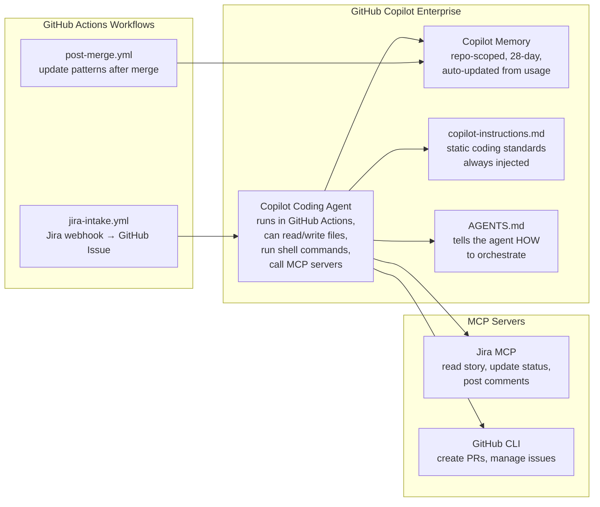
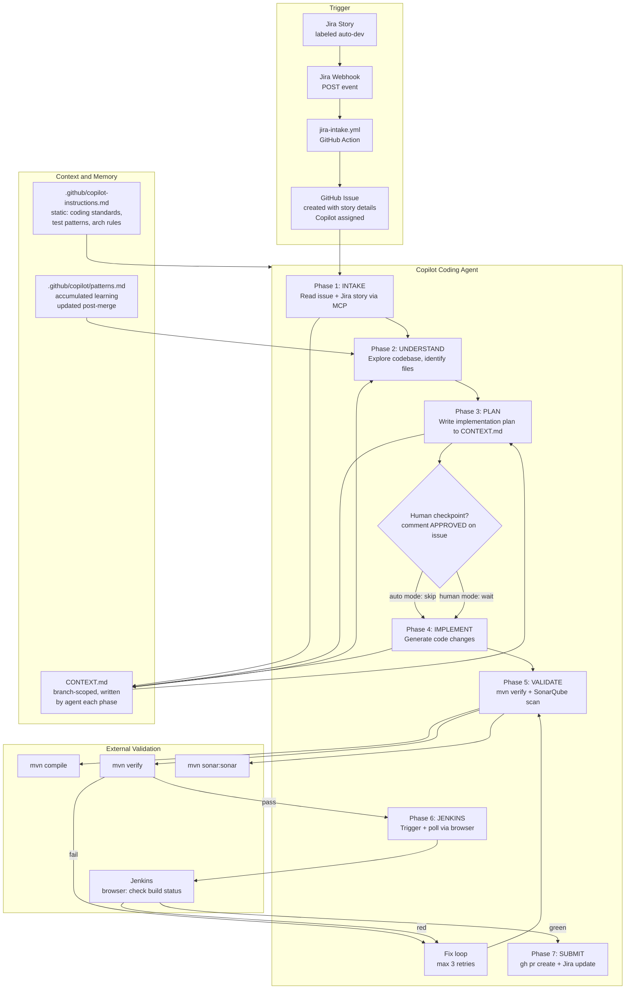
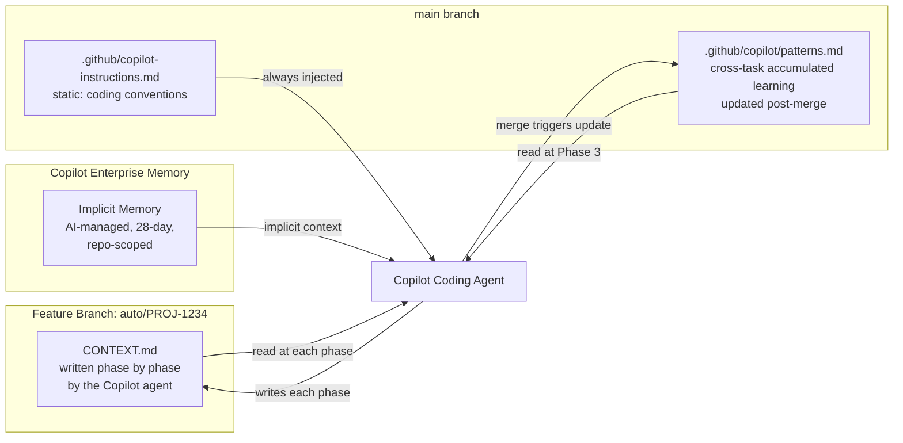
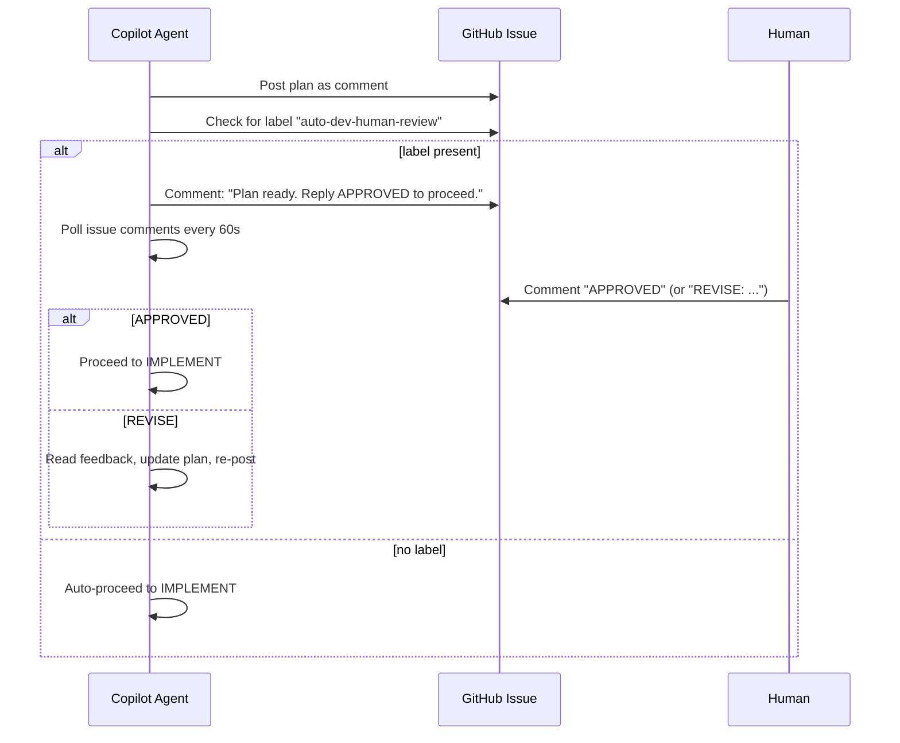
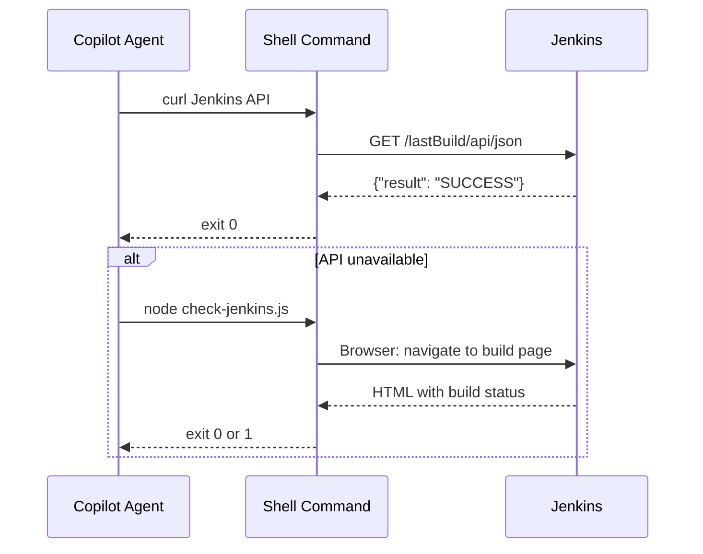
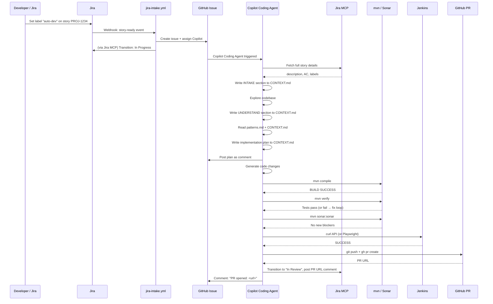
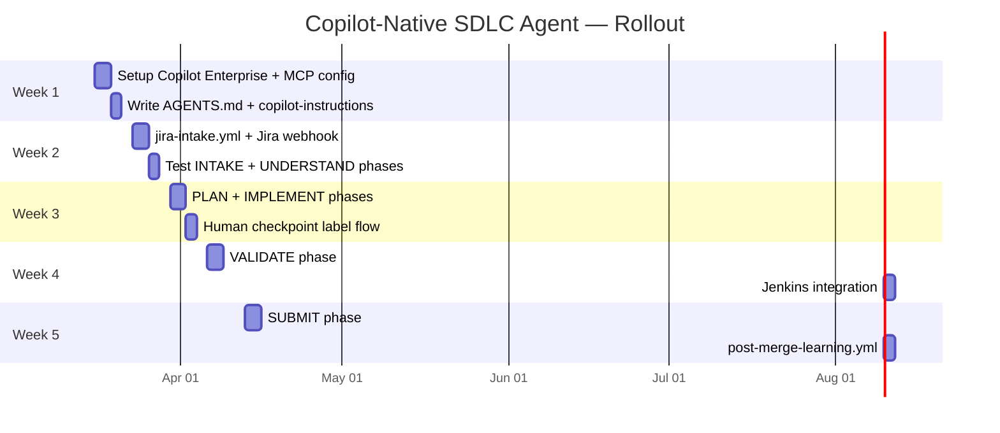

# Copilot-Native SDLC Agent: Jira to PR with Zero Custom Servers

**Premise:** Your employer provides GitHub Copilot Enterprise. You want a fully
automated Jira-story-to-PR flow that runs entirely on Copilot's own agent infrastructure
-- no custom Spring Boot orchestrator, no embedding pipeline, no separate AI server.
The orchestration logic lives in declarative files (`AGENTS.md`, instruction files,
GitHub Actions workflows) that Copilot reads and acts on.

**Key constraint**: Keep every file concise (under ~150 lines) so Copilot agents do
not hit context saturation when reading instructions.

---

## 1. Core Insight: What Copilot Enterprise Gives You



The **Copilot Coding Agent** is the engine. It is triggered by assigning a GitHub Issue
to Copilot. It then reads `AGENTS.md` which instructs it how to proceed phase by phase.
Every external integration (Jira, Jenkins, build, tests) is reached either through an
**MCP server** or a **shell command** that the agent runs in its GitHub Actions sandbox.

---

## 2. End-to-End Architecture



---

## 3. File Structure

```
repo-root/
├── AGENTS.md                               # master orchestration instructions
├── .github/
│   ├── copilot-instructions.md             # static coding standards (always injected)
│   ├── copilot/
│   │   └── patterns.md                     # accumulated cross-task learning
│   └── workflows/
│       ├── jira-intake.yml                 # Jira webhook → GitHub Issue
│       └── post-merge-learning.yml         # update patterns.md after PR merge
└── (each feature branch gets)
    └── CONTEXT.md                          # agent writes this; deleted after merge
```

**Total new files: 5** (plus CONTEXT.md written per branch by the agent itself).

---

## 4. File Contents

### 4.1 `AGENTS.md` -- The Master Orchestrator

This file is the brain. It tells the Copilot Coding Agent exactly how to proceed,
phase by phase. Kept under 150 lines to avoid context saturation.

```markdown
# SDLC Agent Orchestration Instructions

You are an automated SDLC agent. When assigned a GitHub Issue, follow these phases
in order. After each phase, update CONTEXT.md with a summary of what you learned
and decided. Read CONTEXT.md at the start of each phase to resume context.

Read .github/copilot/patterns.md before the PLAN phase to apply lessons from past tasks.

---

## Phase 1: INTAKE

1. Read the GitHub Issue body — it contains the Jira story key and a summary.
2. Use the Jira MCP tool to fetch the full story: description, acceptance criteria,
   labels, and linked issues.
3. Write to CONTEXT.md:
   - Jira key, story summary, acceptance criteria (bullet points)
   - Labels and components (these hint at which code areas to look at)
4. Post a comment on the issue: "Intake complete. Starting codebase analysis."

---

## Phase 2: UNDERSTAND

1. Read CONTEXT.md for story details.
2. Explore the codebase:
   - Search for symbols, files, and classes mentioned in the story.
   - Find the relevant controllers, services, and repositories.
   - Identify files that will likely need changes.
3. Update CONTEXT.md with:
   - List of files to modify (with one-line reason each)
   - Any dependencies, migrations, or config changes required

---

## Phase 3: PLAN

1. Read CONTEXT.md and .github/copilot/patterns.md.
2. Write a concise implementation plan to CONTEXT.md:
   - Ordered list of changes: file, what to add/modify, why
   - Test changes required
   - Any Flyway migration required
3. Post the plan as a comment on the GitHub Issue.
4. If the issue has label `auto-dev-human-review`, wait for a comment containing
   the word "APPROVED" before proceeding to Phase 4.

---

## Phase 4: IMPLEMENT

1. Read CONTEXT.md for the implementation plan.
2. Make all code changes as planned.
3. Follow .github/copilot-instructions.md for coding standards.
4. Run: `mvn compile`
   - If it fails, fix compilation errors before continuing.
5. Update CONTEXT.md: list all files changed.

---

## Phase 5: VALIDATE

1. Run: `mvn verify`
   - If tests fail:
     - Read the failure output carefully.
     - Fix the failing tests or the code causing failures.
     - Re-run `mvn verify`.
     - Retry up to 3 times. If still failing after 3 retries, post a comment on
       the issue: "Tests failing after 3 retries. Human intervention needed."
       Then stop.
2. Run: `mvn sonar:sonar -Dsonar.host.url=$SONAR_URL -Dsonar.token=$SONAR_TOKEN`
   - If SonarQube reports new critical or blocker issues, fix them and re-run.
3. Update CONTEXT.md: test result summary, sonar findings (if any).

---

## Phase 6: JENKINS VALIDATION

1. Use browser automation to check Jenkins:
   - Navigate to $JENKINS_URL/job/$JENKINS_JOB_NAME/lastBuild/api/json
   - If the build is still running, poll every 30 seconds (max 10 minutes).
   - If the build result is SUCCESS, proceed.
   - If FAILURE, read the console output, attempt to fix, and re-trigger.
2. Alternatively, call: `curl -s $JENKINS_URL/job/$JOB/lastBuild/api/json`
   to get build status without a browser.

---

## Phase 7: SUBMIT

1. Create a feature branch named: `auto/<jira-key>-<slug>` (already on this branch).
2. Commit all changes: `git add -A && git commit -m "<jira-key>: <story-summary>"`
3. Push: `git push -u origin HEAD`
4. Create PR:
   ```
   gh pr create \
     --title "<jira-key>: <story-summary>" \
     --body "$(cat .github/pr-template-auto.md)" \
     --base main
   ```
5. Use the Jira MCP tool to:
   - Transition the story to "In Review"
   - Post a comment with the PR URL
6. Post a comment on the GitHub Issue with the PR URL and a summary.

---

## Error handling

- If any external tool (Jira MCP, Jenkins, Sonar) is unreachable, post a comment
  on the issue with the error and stop. Do not guess or skip.
- If you are unsure about scope, post a clarifying question on the issue and stop.
  Never make assumptions about business logic.
```

### 4.2 `.github/copilot-instructions.md` -- Static Coding Standards

Always injected by Copilot Enterprise into every prompt. Keep it short.

```markdown
# Coding Standards for this Repository

**Language:** Java 17+ with Spring Boot 3.x  
**Build:** Maven. Always use `mvn` commands, never `./gradlew`.  
**Testing:** Spock (Groovy) for unit tests. Name spec files `*Spec.groovy`.  
**Database:** Flyway migrations in `src/main/resources/db/migration/`. 
  Format: `V{n}__{description}.sql`. Always add `IF NOT EXISTS` guards.  
**Patterns:** Controller → Service → Repository. No business logic in controllers.  
**Logging:** SLF4J. No raw question text or PII in INFO/WARN logs.  
**Dependencies:** Do not add new Maven dependencies without checking pom.xml first.  
**Security:** Never hardcode credentials. Use `${ENV_VAR}` references.
```

### 4.3 `.github/copilot/patterns.md` -- Accumulated Learning

Written and updated by the `post-merge-learning.yml` workflow after each PR merge.
The agent reads this in Phase 3. Starts empty; grows over time.

```markdown
# Repository Patterns (auto-updated after each merged PR)

<!-- Each entry is added by the post-merge workflow after a PR is merged -->
<!-- Format: ## <date> <jira-key>: <one-line lesson> -->

## Template

## YYYY-MM-DD <KEY>: <lesson learned, one or two sentences max>
Files changed: [list]
Avoid: [what not to do]
Prefer: [what worked well]
```

### 4.4 `.github/workflows/jira-intake.yml` -- Jira Webhook Receiver

This workflow is the bridge between Jira and the Copilot Coding Agent.

```yaml
name: Jira Intake

on:
  repository_dispatch:
    types: [jira-story-ready]

jobs:
  create-issue-and-assign-copilot:
    runs-on: ubuntu-latest
    permissions:
      issues: write
    steps:
      - name: Create GitHub Issue from Jira story
        uses: actions/github-script@v7
        with:
          script: |
            const { jira_key, summary, description, ac, repo_url } =
              context.payload.client_payload;

            const body = [
              `## Jira Story: [${jira_key}](${process.env.JIRA_BASE_URL}/browse/${jira_key})`,
              '',
              `### Summary`,
              summary,
              '',
              `### Acceptance Criteria`,
              ac,
              '',
              `### Description`,
              description,
            ].join('\n');

            const issue = await github.rest.issues.create({
              owner: context.repo.owner,
              repo: context.repo.repo,
              title: `${jira_key}: ${summary}`,
              body,
              labels: ['auto-dev'],
            });

            // Assign Copilot Coding Agent to the issue
            await github.rest.issues.addAssignees({
              owner: context.repo.owner,
              repo: context.repo.repo,
              issue_number: issue.data.number,
              assignees: ['copilot'],
            });

            core.info(`Created issue #${issue.data.number} and assigned to Copilot`);
        env:
          JIRA_BASE_URL: ${{ vars.JIRA_BASE_URL }}
```

**Jira side:** Configure a Jira automation rule:
- Trigger: Issue label added = `auto-dev`
- Action: Send webhook to `https://api.github.com/repos/{owner}/{repo}/dispatches`
  with payload: `{ "event_type": "jira-story-ready", "client_payload": { ... } }`

### 4.5 `.github/workflows/post-merge-learning.yml` -- Pattern Accumulation

After each auto-dev PR is merged, this workflow prompts Copilot to extract a lesson
and appends it to `patterns.md`.

```yaml
name: Post-Merge Learning

on:
  pull_request:
    types: [closed]
    branches: [main]

jobs:
  update-patterns:
    if: |
      github.event.pull_request.merged == true &&
      contains(github.event.pull_request.labels.*.name, 'auto-dev')
    runs-on: ubuntu-latest
    permissions:
      contents: write
      pull-requests: read
    steps:
      - uses: actions/checkout@v4
        with:
          ref: main

      - name: Extract lesson and update patterns.md
        env:
          GH_TOKEN: ${{ secrets.GITHUB_TOKEN }}
          PR_NUMBER: ${{ github.event.pull_request.number }}
          PR_TITLE: ${{ github.event.pull_request.title }}
        run: |
          # Get list of changed files
          FILES=$(gh pr view $PR_NUMBER --json files -q '.files[].path' | head -20)

          DATE=$(date +%Y-%m-%d)
          JIRA_KEY=$(echo "$PR_TITLE" | grep -oP '^[A-Z]+-[0-9]+')

          # Append a new entry to patterns.md
          cat >> .github/copilot/patterns.md << EOF

          ## $DATE $JIRA_KEY: Merged successfully
          Files changed: $FILES
          EOF

          git config user.email "copilot-bot@noreply.github.com"
          git config user.name "Copilot Bot"
          git add .github/copilot/patterns.md
          git diff --cached --quiet || \
            git commit -m "chore: update patterns after $JIRA_KEY merge [skip ci]"
          git push
```

### 4.6 PR Body Template (`.github/pr-template-auto.md`)

```markdown
## {JIRA_KEY}: {STORY_SUMMARY}

### Jira Story
[{JIRA_KEY}]({JIRA_URL}/browse/{JIRA_KEY})

### What was changed and why
<!-- Copilot fills this from CONTEXT.md -->

### Tests
All tests pass. <!-- Copilot confirms from validation phase -->

### Validation
- [x] Build passes (`mvn compile`)
- [x] All tests pass (`mvn verify`)
- [x] SonarQube scan clean
- [x] Jenkins CI green

---
*Generated by SDLC Copilot Agent*
```

---

## 5. Context Memory: How It Works Without a Database

Since there is no custom server, context is persisted in **files on the branch**.



### CONTEXT.md structure (written by the agent)

The agent creates this file on the branch and appends to it after each phase.
It is the agent's "working memory" for the current task.

```markdown
# Task Context: PROJ-1234

## [INTAKE] Story
- **Jira Key:** PROJ-1234
- **Summary:** Add email validation to signup form
- **Acceptance Criteria:**
  - Email must be validated with regex before saving
  - Invalid email returns HTTP 400 with message
- **Labels:** backend, validation

## [UNDERSTAND] Files to change
- `SignupController.java` — add validation before calling service
- `SignupService.java` — add email format check
- `SignupRequest.java` — add @Email annotation
- `V5__add_email_constraint.sql` — add DB check constraint

## [PLAN] Implementation steps
1. Add `@Email` to `SignupRequest.email` field
2. Add `@Valid` to controller method parameter
3. Add `GlobalExceptionHandler` entry for `ConstraintViolationException`
4. Add `EmailValidationTest` in `SignupServiceSpec.groovy`
5. Add Flyway migration for DB constraint

## [IMPLEMENT] Files changed
- `src/main/java/.../SignupRequest.java`
- `src/main/java/.../SignupController.java`
- `src/main/java/.../GlobalExceptionHandler.java`
- `src/test/groovy/.../SignupServiceSpec.groovy`
- `src/main/resources/db/migration/V5__add_email_constraint.sql`

## [VALIDATE] Results
- Build: PASS
- Tests: 47 passed, 0 failed
- SonarQube: 0 new issues

## [JENKINS] Status
- Build #142: SUCCESS
```

---

## 6. Human Checkpoint Design

The orchestrator supports optional human review without stopping the entire flow.



The checkpoint is controlled entirely by the presence of the `auto-dev-human-review`
label on the GitHub Issue. Add or remove the label per story in Jira/GitHub.

---

## 7. Jenkins Integration

Two approaches, in order of preference:

### 7.1 REST API (Simpler, Preferred)

The agent runs a shell command inside its GitHub Actions sandbox:

```bash
# Check build status
STATUS=$(curl -su "$JENKINS_USER:$JENKINS_TOKEN" \
  "$JENKINS_URL/job/$JOB_NAME/lastBuild/api/json" \
  | jq -r '.result')

if [ "$STATUS" != "SUCCESS" ]; then
  echo "Jenkins build failed: $STATUS"
  exit 1
fi
```

Jenkins secrets (`JENKINS_URL`, `JENKINS_USER`, `JENKINS_TOKEN`) are stored as
GitHub repository secrets and injected as environment variables.

### 7.2 Browser Automation (Fallback, No API Access)

If Jenkins does not have API access enabled, the agent can use browser automation
via Playwright in the GitHub Actions sandbox:

```bash
# Install Playwright
npx playwright install chromium

# Run a headless check script
node .github/scripts/check-jenkins.js "$JENKINS_URL" "$JOB_NAME"
```

The check script navigates to the Jenkins build page, finds the build status badge,
and returns exit code 0 (success) or 1 (failure/unstable/running).



---

## 8. Full End-to-End Flow



---

## 9. What You Need to Set Up (One-Time)

| Item | Where | How |
|------|-------|-----|
| Jira webhook | Jira Automation | Fire `jira-story-ready` dispatch event when label `auto-dev` added |
| `JIRA_BASE_URL` | GitHub repo variable | `Settings > Variables > Actions` |
| `JIRA_API_TOKEN` | GitHub repo secret | Jira API token for MCP server |
| `SONAR_URL`, `SONAR_TOKEN` | GitHub repo secrets | SonarQube instance credentials |
| `JENKINS_URL`, `JENKINS_USER`, `JENKINS_TOKEN` | GitHub repo secrets | Jenkins API user token |
| Jira MCP server | `.github/mcp.json` | Configure Jira MCP endpoint (see below) |
| Copilot Coding Agent | GitHub repo settings | Enable under `Settings > Copilot > Coding agent` |
| `patterns.md` | Create empty file | Seed with the template from Section 4.3 |

### MCP Configuration (`.github/mcp.json`)

```json
{
  "mcpServers": {
    "jira": {
      "type": "http",
      "url": "${JIRA_MCP_URL}",
      "headers": {
        "Authorization": "Bearer ${JIRA_API_TOKEN}"
      }
    }
  }
}
```

---

## 10. Comparison: This Approach vs Custom Orchestrator (doc 15)

| Aspect | This (Copilot-native, doc 16) | Custom orchestrator (doc 15) |
|--------|-------------------------------|------------------------------|
| **Setup effort** | Low: 5 files + GitHub secrets | High: full Spring Boot module |
| **Maintenance** | Near-zero: Copilot evolves with GitHub | Ongoing: custom code to maintain |
| **Context memory** | CONTEXT.md (per task) + patterns.md (cross-task) | PostgreSQL context store |
| **Token budget control** | Manual (file length discipline) | Programmatic (PromptAssembler) |
| **Custom logic** | Limited to AGENTS.md instructions | Full Java code |
| **Works offline** | No (requires GitHub) | Can run on-prem |
| **Cost** | Copilot Enterprise subscription only | Subscription + infra (compute, DB) |
| **Scalability** | One task at a time per repo | Concurrent tasks |
| **Browser automation** | Playwright in GH Actions | Playwright in Spring managed process |
| **Best for** | Small teams, fast start, GitHub-centric | Larger orgs, custom workflows, audit trail |

---

## 11. Incremental Rollout Plan

Each step is independently deployable and testable.



### Step-by-step

| Step | What you build | Test it by |
|------|---------------|-----------|
| 1 | Enable Copilot Coding Agent in repo settings; create `.github/copilot-instructions.md`; create empty `patterns.md` | Manually assign Copilot to a test issue; confirm it reads instructions |
| 2 | Write `AGENTS.md` (Phase 1 only: INTAKE) | Create a test GitHub Issue; watch Copilot write CONTEXT.md with story details |
| 3 | Add `jira-intake.yml`; configure Jira webhook | Set `auto-dev` label in Jira; confirm GitHub Issue is created and assigned to Copilot |
| 4 | Expand `AGENTS.md` to include Phase 2 (UNDERSTAND) | Verify Copilot identifies the right files for a sample story |
| 5 | Expand `AGENTS.md` to include Phase 3 (PLAN) + human checkpoint | Verify plan is posted as Issue comment; test APPROVED flow |
| 6 | Expand `AGENTS.md` to include Phase 4 (IMPLEMENT) + Phase 5 (VALIDATE) | Watch Copilot generate code, run `mvn verify`, fix failures |
| 7 | Add Jenkins integration (REST API first, Playwright fallback) | Confirm agent reads Jenkins result and proceeds or stops |
| 8 | Expand `AGENTS.md` to include Phase 7 (SUBMIT) | Verify PR is created, Jira updated, Issue commented |
| 9 | Add `post-merge-learning.yml` | Merge a test PR; verify `patterns.md` is updated |

---

## 12. Risks and Mitigations

| Risk | Mitigation |
|------|-----------|
| Copilot Coding Agent context window limit | Keep CONTEXT.md concise; each phase appends a summary, not raw output; AGENTS.md is under 150 lines |
| Copilot generates code that does not compile | AGENTS.md instructs it to run `mvn compile` after changes and fix errors before continuing |
| Jira webhook is unreliable | Use Jira Automation retry policy; alternatively poll Jira on a cron schedule via a GitHub Action |
| Jenkins API blocked (no token) | Fall back to Playwright browser automation (Section 7.2) |
| `patterns.md` grows too large over time | Add a `trim-patterns.yml` workflow that keeps only the 30 most recent entries |
| Copilot Coding Agent is unavailable (GitHub outage) | Manual fallback: developer picks up the GitHub Issue, reads CONTEXT.md for context |
| Story requirements are ambiguous | AGENTS.md instructs the agent to post a clarifying question on the Issue and stop, never guess |
| Secret leakage in CONTEXT.md | copilot-instructions.md explicitly forbids writing secrets or tokens to any file |
